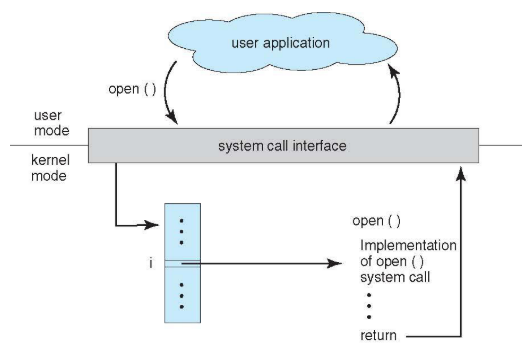
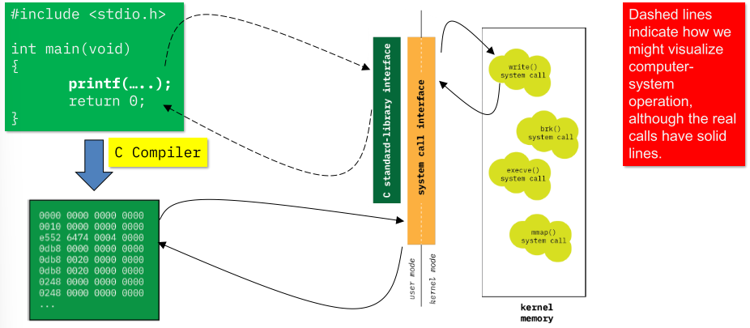
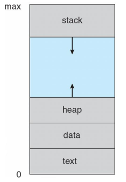
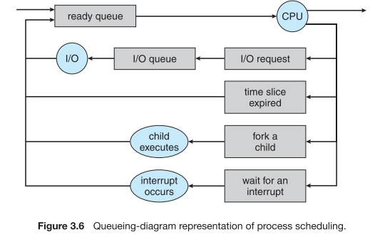

# (CSC 360) - Operating Systems - Complete Notes - Spring 2023

[TOC]

- [Class Intro](#class-intro)
  
  * [Topics](#topics)
  * [Course Evaluation](#course-evaluation)
  * [lecture Slides](#lecture-slides)
- [Lecture 1 (11-01-2023)](#lecture-1--11-01-2023-)
  * [Some aspects of OS operation](#some-aspects-of-os-operation)
  * [What happens at startup?](#what-happens-at-startup-)
  * [What happens at startup? (In order)](#what-happens-at-startup---in-order-)
  * [Computer System Organization](#computer-system-organization)
  * [Computer-System Operation](#computer-system-operation)
  * [Common functions of interrupts](#common-functions-of-interrupts)
  * [Interrupt Timeline](#interrupt-timeline)
  * [Interrupt Handling](#interrupt-handling)
- [Lecture 2 (12-01-2023)](#lecture-2--12-01-2023-)
  * [Storage Structure](#storage-structure)
  * [Storage Hierarchy](#storage-hierarchy)
  * [Storage-Device Hierarchy](#storage-device-hierarchy)
  * [Caching](#caching)
  * [Direct Memory Access Structure](#direct-memory-access-structure)
  * [How a Modern Computer Works](#how-a-modern-computer-works)
  * [Computer-System Architecture](#computer-system-architecture)
  * [Symmetric Multiprocessing Architecture](#symmetric-multiprocessing-architecture)
  * [A Dual-Core Design](#a-dual-core-design)
  * [Operating System Structure](#operating-system-structure)
  * [Memory Layout for Multi-programmed System](#memory-layout-for-multi-programmed-system)
- [Lecture 3 (16-01-2013)](#lecture-3--16-01-2013-)
  * [Operating-System Operations](#operating-system-operations)
  * [Transition from User to Kernel Mode](#transition-from-user-to-kernel-mode)
  * [Process Management](#process-management)
  * [Process Management Activities](#process-management-activities)
  * [Memory Management](#memory-management)
  * [Storage Management](#storage-management)
  * [Mass-Storage Management](#mass-storage-management)
  * [Performance of Various Levels of Storage](#performance-of-various-levels-of-storage)
  * [Migration of data “A” from Disk to Register](#migration-of-data--a--from-disk-to-register)
  * [I/O Subsystem](#i-o-subsystem)
  * [Protection and Security](#protection-and-security)
- [Lecture 4 (18-01-2023)](#lecture-4--18-01-2023-)
  * [Virtual memory](#virtual-memory)
  * [Virtualization](#virtualization)
  * [Cloud Computing](#cloud-computing)
  * [Real-Time Embedded Systems](#real-time-embedded-systems)
  * [Open-Source Operating Systems](#open-source-operating-systems)
  * [Outline - Operating System structures](#outline---operating-system-structures)
  * [OS System Services](#os-system-services)
      - [Overview](#overview)
      - [User Interface](#user-interface)
      - [Program execution](#program-execution)
      - [Communication](#communication)
      - [Error detection](#error-detection)
  * [System Calls](#system-calls)
      - [Examples](#examples)
  * [System Calls implementation](#system-calls-implementation)
  * [API - System Call - OS relationship](#api---system-call---os-relationship)
- [Lecture 5 (20-01-2023)](#lecture-5--20-01-2023-)
  * [System Call Parameter Passing](#system-call-parameter-passing)
  * [Parameter Passing via Table](#parameter-passing-via-table)
  * [Types of System Calls](#types-of-system-calls)
      - [Process control](#process-control)
      - [File Management](#file-management)
      - [Device management](#device-management)
      - [System Information maintenance](#system-information-maintenance)
      - [Communications](#communications)
      - [Protection](#protection)
  * [Examples of Windows and Unix System Calls](#examples-of-windows-and-unix-system-calls)
  * [Role of C standard library](#role-of-c-standard-library)
- [Lecture 6 (23-01-2023)](#lecture-6--23-01-2023-)
  * [Standard C Library Example](#standard-c-library-example)
  * [System Programs](#system-programs)
      - [File management](#file-management)
      - [Status information](#status-information)
      - [File modification](#file-modification)
      - [Programming-language support](#programming-language-support)
      - [Program loading and execution](#program-loading-and-execution)
      - [Communications](#communications-1)
  * [What remains: application; background](#what-remains--application--background)
  * [Summary](#summary)
- [Lecture 7 (25-01-2023)](#lecture-7--25-01-2023-)
  * [Outline - Processes](#outline---processes)
  * [Objectives](#objectives)
  * [Process Concept](#process-concept)
  * [Processes and Threads](#processes-and-threads)
  * [Process in Memory](#process-in-memory)
  * [Process State](#process-state)
  * [Process Control Block (PCB)](#process-control-block--pcb-)
  * [Context switch](#context-switch)
  * [CPU Switch From Process to Process](#cpu-switch-from-process-to-process)
  * [Process Representation in Linux](#process-representation-in-linux)
- [Lecture 8 (26-01-2023)](#lecture-8--26-01-2023-)
  * [Process Scheduling](#process-scheduling)
  * [Ready Queue And Various I/O Device Queues](#ready-queue-and-various-i-o-device-queues)
  * [Representation of Process Scheduling](#representation-of-process-scheduling)
  * [Schedulers](#schedulers)
  * [Addition of Medium Term Scheduling](#addition-of-medium-term-scheduling)
  * [Multitasking in Mobile Systems](#multitasking-in-mobile-systems)
  * [Context Switch](#context-switch)
  * [Operations on Processes](#operations-on-processes)
  * [Process Creation](#process-creation)
  * [A Tree of Processes in Linux](#a-tree-of-processes-in-linux)
  * [Process Creation (Cont.)](#process-creation--cont-)
  * [C Program Forking Separate Process](#c-program-forking-separate-process)
  * [Process Termination](#process-termination)
- [Lecture 9 (01-30-2023)](#lecture-9--01-30-2023-)
  * [Interprocess Communication](#interprocess-communication)
  * [Communications Models](#communications-models)
  * [Interprocess Communication – Shared Memory](#interprocess-communication---shared-memory)
  * [Interprocess Communication – Message Passing](#interprocess-communication---message-passing)
  * [Direct Communication](#direct-communication)
  * [Indirect Communication](#indirect-communication)
  * [Synchronization](#synchronization)
  * [Buffering](#buffering)
- [Lecture 10 (02-01-23)](#lecture-10--02-01-23-)
  * [Examples of IPC Systems – Shared Memory](#examples-of-ipc-systems---shared-memory)
  * [Examples IPC – Shared Memory (Producer)](#examples-ipc---shared-memory--producer-)
  * [Examples IPC – Shared Memory (Consumer)](#examples-ipc---shared-memory--consumer-)
  * [Pipes](#pipes)
  * [Ordinary Pipes](#ordinary-pipes)
  * [Named Pipes](#named-pipes)
  * [Summary](#summary-1)
- [Lecture 11 (02-02-23)](#lecture-11--02-02-23-)
  * [Objectives](#objectives-1)
  * [Motivation](#motivation)
  * [Multithreaded Server Architecture](#multithreaded-server-architecture)
  * [Benefits](#benefits)
  * [Multicore Programming](#multicore-programming)
  * [Concurrency vs. Parallelism](#concurrency-vs-parallelism)
  * [Single and Multithreaded Processes](#single-and-multithreaded-processes)
  * [Amdahl’s Law](#amdahl-s-law)
  * [User Threads and Kernel Threads](#user-threads-and-kernel-threads)
  * [Multithreading Models](#multithreading-models)
    + [Many-to-One](#many-to-one)
    + [One-to-One](#one-to-one)
    + [Many-to-Many Model](#many-to-many-model)
- [Lecture 12 (02-06-23)](#lecture-12--02-06-23-)
  * [Two-level Model](#two-level-model)
  * [Thread Libraries](#thread-libraries)
  * [Pthreads](#pthreads)
  * [Pthreads Example](#pthreads-example)
  * [Threading Issues](#threading-issues)
  * [Semantics of fork() and exec()](#semantics-of-fork---and-exec--)
  * [Signal Handling](#signal-handling)
  * [Thread Cancellation](#thread-cancellation)
  * [Thread-Local Storage](#thread-local-storage)
  * [Scheduler Activations](#scheduler-activations)
- [Lecture 13 (02-08-23)](#lecture-13--02-08-23-)
  * [Windows Threads](#windows-threads)
  * [Linux Threads](#linux-threads)
  * [Summary](#summary-2)
- [Lecture 14 (02-09-23)](#lecture-14--02-09-23-)
  * [Objectives](#objectives-2)
  * [Background](#background)
  * [Threads and problems...](#threads-and-problems)
- [Lecture 15 (02-13-23)](#lecture-15--02-13-23-)
  * [Race condition](#race-condition)
  * [Producer-Consumer Problem](#producer-consumer-problem)
- [Lecture 16 (02-15-23)](#lecture-16--02-15-23-)
  * [Code for producer, consumer](#code-for-producer--consumer)
  * [Race condition: solution](#race-condition--solution)
  * [What a CS solution must have](#what-a-cs-solution-must-have)
  * [How CS solutions are used](#how-cs-solutions-are-used)
  * [Failed attempt #1](#failed-attempt--1)
  * [Failed attempt #2](#failed-attempt--2)
  * [Peterson’s Solution](#peterson-s-solution)
  * [Successful attempt](#successful-attempt)
  * [Synchronization Hardware](#synchronization-hardware)
  * [Lock version of CS problem](#lock-version-of-cs-problem)
  * [Test-And-Set](#test-and-set)
  * [Swap](#swap)
  * [A bit more about hardware](#a-bit-more-about-hardware)
  * [Major caveat](#major-caveat)
- [Lecture 17 (02-27-23)](#lecture-17--02-27-23-)
  * [More than two threads?](#more-than-two-threads-)
  * [Mutex Locks](#mutex-locks)
  * [acquire() and release()](#acquire---and-release--)
  * [Semaphore](#semaphore)
  * [Semaphore Usage](#semaphore-usage)
  * [Semaphore Implementation](#semaphore-implementation)
  * [Semaphore Implementation with no Busy waiting](#semaphore-implementation-with-no-busy-waiting)
  * [Mutex Functions (pthread)](#mutex-functions--pthread-)
  * [Problems can still occur...](#problems-can-still-occur)
      - [Thread 1](#thread-1)
      - [Thread 2](#thread-2)
  * [Deadlock & Resource Allocation Graph (RAG)](#deadlock---resource-allocation-graph--rag-)
  * [Dealing with Deadlock](#dealing-with-deadlock)
  * [Conditional Locking](#conditional-locking)
  * [Beyond Mutexes](#beyond-mutexes)
  * [Concept: Guarded Commands](#concept--guarded-commands)
  * [Semaphores](#semaphores)
  * [Mutexes via Semaphores](#mutexes-via-semaphores)
  * [Recall: Producer-Consumer Problem](#recall--producer-consumer-problem)
  * [Recall: Producer-Consumer Problem](#recall--producer-consumer-problem-1)
  * [Producer-Consumer with Semaphores](#producer-consumer-with-semaphores)
  * [Multiple producers/consumers](#multiple-producers-consumers)
  * [POSIX Semaphores](#posix-semaphores)
- [Lecture 18 (03-02-23)](#lecture-18--03-02-23-)
  * [Outline](#outline)
  * [Objectives](#objectives-3)
  * [Background](#background-1)
  * [Histogram of CPU-burst Times](#histogram-of-cpu-burst-times)
  * [CPU Scheduler](#cpu-scheduler)
  * [Dispatcher](#dispatcher)
  * [Scheduling Criteria](#scheduling-criteria)
  * [Scheduling Algorithm Optimization Criteria](#scheduling-algorithm-optimization-criteria)
  * [First- Come, First-Served (FCFS) Scheduling](#first--come--first-served--fcfs--scheduling)
  * [FCFS Scheduling (Cont.)](#fcfs-scheduling--cont-)
  * [Shortest-Job-First (SJF) Scheduling](#shortest-job-first--sjf--scheduling)
  * [Example of SJF](#example-of-sjf)
  * [Determining Length of Next CPU Burst](#determining-length-of-next-cpu-burst)
  * [Prediction of the Length of the Next CPU Burst](#prediction-of-the-length-of-the-next-cpu-burst)
  * [Examples of Exponential Averaging](#examples-of-exponential-averaging)
  * [Example of Shortest-remaining-time-first](#example-of-shortest-remaining-time-first)
  * [Priority Scheduling](#priority-scheduling)
  * [Example of Priority Scheduling](#example-of-priority-scheduling)
  * [Round Robin (RR)](#round-robin--rr-)
  * [Example of RR with Time Quantum = 4](#example-of-rr-with-time-quantum---4)
- [Lecture 19 (03-06-23)](#lecture-19--03-06-23-)
- [# TEXTBOOK](#--textbook)
- [NOTES START](#notes-start)
- [Chapter 1 (Introduction)](#chapter-1--introduction-)
  * [1.1 - What Operating Systems Do](#11---what-operating-systems-do)
      - [User View](#user-view)
        * [Mainframes and Minicomputers](#mainframes-and-minicomputers)
        * [Workstations and servers](#workstations-and-servers)
        * [Headless systems](#headless-systems)
        * [The system View](#the-system-view)
  * [1.2 - Computer-System Organization](#12---computer-system-organization)
      - [Computer system operation](#computer-system-operation)
      - [Storage Structure](#storage-structure-1)
  * [1.3 - Computer-System Architecture](#13---computer-system-architecture)
      - [Single Processor systems](#single-processor-systems)
      - [Multiprocessor Systems](#multiprocessor-systems)
        * [3 main advantages](#3-main-advantages)
        * [2 Types of Multiprocessing](#2-types-of-multiprocessing)
        * [Multicore Processors](#multicore-processors)
        * [Blade Servers](#blade-servers)
        * [Clustered Systems](#clustered-systems)
  * [1.4 - Operating-System Structure](#14---operating-system-structure)
  * [1.5 - Operating-System Operations](#15---operating-system-operations)
      - [Dual-Mode and Multimode Operation](#dual-mode-and-multimode-operation)
        * [User mode vs Kernel Mode](#user-mode-vs-kernel-mode)
      - [Timer](#timer)
  * [1.6 - Process Management](#16---process-management)
      - [The operating system is responsible for the following activities in connection with process management:](#the-operating-system-is-responsible-for-the-following-activities-in-connection-with-process-management-)
  * [1.7 - Memory Management](#17---memory-management)
      - [The operating system is responsible for the following activities in connection with memory management:](#the-operating-system-is-responsible-for-the-following-activities-in-connection-with-memory-management-)
  * [1.8 - Storage Management](#18---storage-management)
      - [The operating system is responsible for the following activities in connection with file management:](#the-operating-system-is-responsible-for-the-following-activities-in-connection-with-file-management-)
- [Chapter 2 (Operating System Structures)](#chapter-2--operating-system-structures-)
  * [2.1 - Operating-System Services](#21---operating-system-services)
      - [User interface types](#user-interface-types)
      - [Program Execution](#program-execution)
      - [I/O operations](#i-o-operations)
      - [File-system Manipulation](#file-system-manipulation)
      - [Communications](#communications-2)
      - [Error detection](#error-detection-1)
      - [Resource allocation](#resource-allocation)
      - [Accounting](#accounting)
      - [Protection and Security](#protection-and-security-1)
  * [2.2 - User and Operating-System Interface](#22---user-and-operating-system-interface)
      - [Command Interpreters](#command-interpreters)
      - [Graphical User Interfaces](#graphical-user-interfaces)
  * [2.3 - System Calls](#23---system-calls)
      - [Three general methods are used to pass parameters to the operating system.](#three-general-methods-are-used-to-pass-parameters-to-the-operating-system)
  * [2.4 - Types of System Calls](#24---types-of-system-calls)
      - [Process control](#process-control-1)
        * [To create a new proccess](#to-create-a-new-proccess)
        * [Responsibilities:](#responsibilities-)
      - [File manipulation](#file-manipulation)
        * [To create and delete files:](#to-create-and-delete-files-)
        * [Responsibilities:](#responsibilities--1)
      - [Device manipulation](#device-manipulation)
        * [Responsibilities:](#responsibilities--2)
      - [Information maintenance](#information-maintenance)
        * [Responsibilities:](#responsibilities--3)
      - [Communications](#communications-3)
        * [Responsibilities:](#responsibilities--4)
      - [Protection](#protection-1)
        * [Responsibilities:](#responsibilities--5)
  * [2.5 - System Programs](#25---system-programs)
      - [System Programs](#system-programs-1)
      - [Application programs](#application-programs)
  * [2.6 - Operating-System Design and Implementation](#26---operating-system-design-and-implementation)
      - [Design Goals](#design-goals)
      - [Mechanisms (How) and Policies (What)](#mechanisms--how--and-policies--what-)
      - [Implementation](#implementation)
  * [2.7 - Operating-System Structure](#27---operating-system-structure)
      - [Simple Structure](#simple-structure)
      - [Layered Approach](#layered-approach)
      - [Microkernels](#microkernels)
        * [Benefits of the microkernel approach](#benefits-of-the-microkernel-approach)
        * [Drawbacks of the microkernel approach](#drawbacks-of-the-microkernel-approach)
      - [Modules](#modules)
      - [Hybrid Systems](#hybrid-systems)
- [Chapter 3 (Processes)](#chapter-3--processes-)
  * [3.1 - Process Concept](#31---process-concept)
      - [The Process](#the-process)
        * [Active vs Passive Entity](#active-vs-passive-entity)
      - [Process State](#process-state-1)
      - [Process Control Block](#process-control-block)
  * [3.2 - Process Scheduling](#32---process-scheduling)
      - [Scheduling Queues](#scheduling-queues)
      - [Schedulers](#schedulers-1)
        * [Long vs Short](#long-vs-short)
          + [Medium-Term Scheduler](#medium-term-scheduler)
      - [Context Switch](#context-switch-1)
  * [3.3 - Operations on Processes](#33---operations-on-processes)
      - [Process Creation](#process-creation-1)
        * [When a process creates a new process, two possibilities for execution exist:](#when-a-process-creates-a-new-process--two-possibilities-for-execution-exist-)
        * [There are also two address-space possibilities for the new process:](#there-are-also-two-address-space-possibilities-for-the-new-process-)
      - [Process Termination](#process-termination-1)
        * [A parent may terminate the execution of one of its children for a variety of reasons, such as these:](#a-parent-may-terminate-the-execution-of-one-of-its-children-for-a-variety-of-reasons--such-as-these-)
  * [3.4 - Interprocess Communication](#34---interprocess-communication)
  * [3.5 - Examples of IPC Systems](#35---examples-of-ipc-systems)
    + [IPC (Inter-process Communication) with message passing](#ipc--inter-process-communication--with-message-passing)
      - [Naming](#naming)
        * [Direct Communication](#direct-communication-1)
        * [Indirect Communication](#indirect-communication-1)
      - [Synchronization of Process Communication](#synchronization-of-process-communication)
      - [Buffering](#buffering-1)
    + [IPC (Inter-process Communication) with shared memory](#ipc--inter-process-communication--with-shared-memory)
      - [Producer - Consumer Problem](#producer---consumer-problem)
        * [Bounded vs Unbounded Buffers](#bounded-vs-unbounded-buffers)
- [Chapter 4 (Threads)](#chapter-4--threads-)
  * [4.1 - Overview](#41---overview)
      - [Motivation](#motivation-1)
      - [Benefits of threading](#benefits-of-threading)
  * [4.2 - Multicore Programming](#42---multicore-programming)
      - [Challenges in multicore Programming](#challenges-in-multicore-programming)
      - [Types of Parallelism (Data vs Task)](#types-of-parallelism--data-vs-task-)
  * [4.3 - Multithreading Models](#43---multithreading-models)
      - [Many-to-One Model](#many-to-one-model)
      - [One-to-One Model](#one-to-one-model)
      - [Many-to-Many Model](#many-to-many-model-1)
  * [4.4 - Thread Libraries](#44---thread-libraries)
      - [Pthreads Library](#pthreads-library)
  * [4.6 - Threading Issues](#46---threading-issues)
      - [The fork() and exec() System Calls](#the-fork---and-exec---system-calls)
      - [Signal Handling](#signal-handling-1)
        * [**Pattern of signaling**](#--pattern-of-signaling--)
        * [**A signal may be *handled* by one of two possible handlers**](#--a-signal-may-be--handled--by-one-of-two-possible-handlers--)
        * [**In multithreaded cases a signal can be sent via these options**](#--in-multithreaded-cases-a-signal-can-be-sent-via-these-options--)
        * [Async vs sync signals](#async-vs-sync-signals)
      - [Thread Cancellation](#thread-cancellation-1)
      - [Thread-Local Storage (TLS)](#thread-local-storage--tls-)
      - [Scheduler Activations](#scheduler-activations-1)
- [Chapter 5 (Process Synchronization)](#chapter-5--process-synchronization-)
  * [5.1 Background](#51-background)
  * [5.2 The Critical-Section Problem](#52-the-critical-section-problem)
      - [Solutions to the critical section problem](#solutions-to-the-critical-section-problem)
        * [Methods](#methods)
        * [Implementations (Locks)](#implementations--locks-)
  * [5.3 Peterson’s Solution](#53-peterson-s-solution)
  * [5.5 Mutex Locks](#55-mutex-locks)
      - [Conditional variables](#conditional-variables)
        * [Why conditional variables instead of mutex?](#why-conditional-variables-instead-of-mutex-)
  * [5.6 Semaphores](#56-semaphores)
  * [5.7 Classic Problems of Synchronization](#57-classic-problems-of-synchronization)
- [Midterm Review](#midterm-review)
    + [batching processing](#batching-processing)
      - [Multiprogramming](#multiprogramming)
    + [Time Sharing (Multitasking)](#time-sharing--multitasking-)
    + [Process states and the state transition diagram](#process-states-and-the-state-transition-diagram)
    + [Process Tree](#process-tree)
    + [Mode switch (User vs kernel mode)](#mode-switch--user-vs-kernel-mode-)
    + [Context switch](#context-switch-1)
    + [IPC (Inter-process Communication) with message passing](#ipc--inter-process-communication--with-message-passing-1)
      - [Naming](#naming-1)
        * [Direct Communication](#direct-communication-2)
        * [Indirect Communication](#indirect-communication-2)
      - [Synchronization of Process Communication](#synchronization-of-process-communication-1)
      - [Buffering](#buffering-2)
    + [IPC (Inter-process Communication) with shared memory](#ipc--inter-process-communication--with-shared-memory-1)
      - [Producer - Consumer Problem](#producer---consumer-problem-1)
        * [Bounded vs Unbounded Buffers](#bounded-vs-unbounded-buffers-1)
    + [Threads](#threads)
      - [Overview](#overview-1)
        * [Motivation](#motivation-2)
        * [Benefits of threading](#benefits-of-threading-1)
      - [Multicore Programming](#multicore-programming-1)
        * [Challenges in multicore Programming](#challenges-in-multicore-programming-1)
        * [Types of Parallelism (Data vs Task)](#types-of-parallelism--data-vs-task--1)
    + [User thread vs. kernel thread](#user-thread-vs-kernel-thread)
    + [Thread model](#thread-model)
      - [Many-to-One Model](#many-to-one-model-1)
      - [One-to-One Model](#one-to-one-model-1)
      - [Many-to-Many Model](#many-to-many-model-2)
    + [The critical section problem and algorithms to solve the problem](#the-critical-section-problem-and-algorithms-to-solve-the-problem)
      - [Solutions to the critical section problem](#solutions-to-the-critical-section-problem-1)
        * [Methods](#methods-1)
        * [Implementations (Locks)](#implementations--locks--1)
    + [Understand how to use mutex, semaphore, condition variable (IMPORTANT)](#understand-how-to-use-mutex--semaphore--condition-variable--important-)
      - [Mutex](#mutex)
      - [Semaphores](#semaphores-1)
      - [Conditional variables](#conditional-variables-1)
        * [Why conditional variables instead of mutex?](#why-conditional-variables-instead-of-mutex--1)
  * [// Programming Section](#---programming-section)
    + [Processes](#processes)
      - [fork()](#fork--)
        * [Fork the current program](#fork-the-current-program)
        * [Fork with Child/Parent conditional](#fork-with-child-parent-conditional)
      - [wait()](#wait--)
      - [waitpid()](#waitpid--)
      - [kill()](#kill--)
      - [exec*() family](#exec----family)
        * [execl()](#execl--)
        * [execlp()](#execlp--)
        * [execle()](#execle--)
        * [execv()](#execv--)
        * [execvp()](#execvp--)
        * [execve()](#execve--)
    + [Shared memory (IPC system calls)](#shared-memory--ipc-system-calls-)
      - [shmget()](#shmget--)
      - [shmat()](#shmat--)
      - [shmdt()](#shmdt--)
      - [Example Using shmget(), shmat() and shmdt()](#example-using-shmget----shmat---and-shmdt--)
    + [Threads (IMPORTANT)](#threads--important-)
      - [pthread_attr_init()](#pthread-attr-init--)
      - [pthread_create()](#pthread-create--)
      - [pthread_join ()](#pthread-join---)
      - [Example Using pthread_join() and pthread_create()](#example-using-pthread-join---and-pthread-create--)
    + [Semaphores, Conditional variables, mutex, monitors and Proc. sync. (IMPORTANT)](#semaphores--conditional-variables--mutex--monitors-and-proc-sync--important-)
      - [sem_init()](#sem-init--)
      - [sem_wait()](#sem-wait--)
      - [sem_post()](#sem-post--)
      - [pthread_mutex_lock()](#pthread-mutex-lock--)
      - [pthread_mutex_unlock()](#pthread-mutex-unlock--)
      - [pthread_cond_wait()](#pthread-cond-wait--)
      - [pthread_cond_signal()](#pthread-cond-signal--)

# Class Intro

> Prof: Ahmad Abdullah
>
> Email: abdullah@uvic.ca
>
> Office Hours:
>
> - Monday: 11:30am - 1:00pm
> - Wednesday: 10:00am - 11:00am
> - Thursday: 11:30am - 1:00pm

## Topics

To understand how a set of computing resources can be shared safely, efficiently, and effectively among many users, including the major concepts of modern operating systems and the relationship between the OS and the architecture of computer systems.

- Introduction to Operating Systems
- Operating system structures
- Concurrent processes and programming
- CPU scheduling
- Memory management and virtual memory
- File systems and storage management


> All chapters covered:  ("//" = split in slides)
>
> - **Chapter 1 - Overview of operating systems**
>   - 1.1, 1.2, 1.3 // 1.4, 1.5, 1.6, 1.7, 1.8
> - **Chapter 2 - Operating system structures**
>   - 2.1, 2.2, 2.3, 2.4, 2.5 // 2.6, 2.7
> - **Chapter 3 - Process Management**
>   - 3.1, 3.2, 3.3, 3.4 // 3.5
> - **Chapter 4 - Threads**
>   - 4.1, 4.2, 4.3, 4.4, 4.6
> - **Chapter 5 - Process Synchronization**
>   - 5.1, 5.2, 5.3 // 5.5, 5.6, 5.7
>
> 
>
> Formatting Legend: 
>
> - Chapters = H1
> - Sub headings (ex, 1.1, 1.2, etc.) = H2
> - Sub-Sub heading titles = H4

## Course Evaluation

- **Assignments (45%)**
  - A1 (15%)
  - A2 (15%)
  - A3 (15%)
- **Exams (55%)**
  - Midterm (20%) - Feb 16th 
  - Final Exam (35%) - TBD

## lecture Slides

[Slide 0 - Introduction to operating systems](assets/L0.pdf) 

[Slide 1 - Operating System Structures](assets/L1.pdf) 

# Lecture 1 (11-01-2023)

## Some aspects of OS operation

- Given that a top-down definition is out of reach....
- **...We will instead approach our study of operating systems by looking at the from the top down perspectives.**
- Some initial perspectives (ie. not and exhaustive list)
  - What happens at startup
  - what are the consequences of physical concurrency?
  - What are the consequences of different data storage devices (speeds, capacities)?
  - What are some typical OS structures?
  - what are foundational OS abstractions?

## What happens at startup?

- Bootstrap program 
  - minimal progra mloaded into computer at power-up boot or reboot
  - Normally stored in ROM or EPROM (aka firmware)
- These programs load in progressively more powerful programs
  - Initializes all aspects of the computer system 
  - Final step is to load OS kernel and begin its execution (i.e., in Unix, start process 0, which forks itself to create in process 1, such that this latter process is the ancestor of all other processes).
  - Note: We will go into gruesome detail this semester on the concept of a process.

## What happens at startup? (In order)

- BIOS - The computer is turned on, and the BIOS initializes the hardware
- MBR - The BIOS calls code stored in the MBR at the start of disk 0
- GRUB - Grand Unified Bootloader executes the hardcoded Kernel
- KERNAL - Kernel executes /bin/init (i.e. process 1)
- MAIN MEMEORY - init executes  runlevel1  program
- RUNLEVEL - run level programs are executed from /etc/rc.d/rc.*.d/

## Computer System Organization

- One or more CPUs, device controllers connect through a common bus
- Access a shared memory
- Physically concurrent CPUs and devices compete for memory cycles

## Computer-System Operation

- I/O devices and the CPU can execute concurrently 
- Each device controller is in charge of a particular device type 
- Each device controller has a local buffer 
- CPU moves data from/to main memory to/from local buffers 
- I/O is from the device to local buffer of controller 
- Device controller informs CPU that it has finished its operation by causing an **<u>interrupt</u>**

## Common functions of interrupts

- An interrupt event causes control to be transferred to the **interrupt service routine** (aka **interrupt handler**)
  - This is normally found through the i**nterrupt vector** 
  - The vector contains the mapping / addresses of all hardware interrupt code in the OS
- Interrupt hardware must also cause **address of interrupted instruction** to be saved
  - If interrupt priorities are possible, then interrupted instruction might be within a handler!
- A **trap** or **exception** is a software-generated interrupt
  - Caused by an error or a user request
- **Bottom line: At its core, an operating system is interrupt driven**

## Interrupt Timeline


## Interrupt Handling 

- The operating system preserves the state of the CPU by storing registers and the program counter.
- Determines which type of interrupt has occurred:
  - Polling
  - <u>Vectored interrupt system</u> 
- Separate segments of code determine what action should be taken for each type of interrupt.

> **Vectored Interrupts**
>
> The purpose of a vectored interrupt mechanism is to reduce the
> need for a single interrupt handler to search all possible sources of interrupts to determine which one needs service.

- Before handling an interrupt, operating system **preserves the state of the CPU.**
  - Values in CPU registers (general purpose, status, etc.)
  - Value of program counter
- The OS must determine precisely what interrupt has occurred:
  - Approach 1: **poll** / ask the interrupt controller for device information
  - Approach 2: device is associated with a particular spot in the **interrupt vector**, therefore the fact of the interrupt directly indicates starting address of handler’s code.
  - The approach used depends upon OS, hardware architecture, device type.


- Code in the handler for the interrupt determine actions to take.
- After handler’s work is completed, **CPU state is restored.**

# Lecture 2 (12-01-2023)

## Storage Structure

- Main memory – only large storage media that the CPU can access directly
  - **Random access**
  - Typically **volatile**
- Secondary storage – extension of main memory that provides large **nonvolatile** storage capacity
- Hard disks – rigid metal or glass platters covered with magnetic recording material
  - Disk surface is logically divided into **tracks**, which are subdivided into sectors 
  - The **disk controller** determines the logical interaction between the device and the computer
- **Solid-state disks** – faster than hard disks, nonvolatile
  - Various technologies 
  - Becoming more popular

## Storage Hierarchy

- Storage systems organized in hierarchy
  - Speed 
  - cost 
  - Volatility
- **Caching** – copying information into faster storage system; main memory can be viewed as a cache for secondary storage
- **Device Driver** for each device controller to manage I/O
  - Provides uniform interface between controller and kernel

## Storage-Device Hierarchy


## Caching

- Important principle, performed at many levels in a computer (in hardware, operating system, software)
- Information in use copied from slower to faster storage temporarily
- Faster storage (cache) checked first to determine if information is there
  - If it is, information used directly from the cache (fast) 
  - If not, data copied to cache and used there
- Cache smaller than storage being cached
  - Cache management important design problem
  - Cache size and replacement policy

## Direct Memory Access Structure

- Used for high-speed I/O devices able to transmit information at close to memory speeds
- Device controller transfers blocks of data from buffer storage directly to main memory without CPU intervention
- Only one interrupt is generated per block, rather than the one interrupt per byte

## How a Modern Computer Works


## Computer-System Architecture

- Most systems use a single general-purpose processor

  - Most systems have special-purpose processors as well

- Multiprocessors systems growing in use and importance

  - Also known as parallel systems, tightly-coupled systems

  - Advantages include:

    - **Increased throughput** 

    - **Economy of scale** 
    - **Increased reliability** – graceful degradation or fault tolerance

  - Two types:

    - **Asymmetric Multiprocessing** – each processor is assigned a specific task
    - **Symmetric Multiprocessing** – each processor performs all tasks

## Symmetric Multiprocessing Architecture


## A Dual-Core Design

- Multi-chip and multicore
- Systems containing all chips
  - Chassis containing multiple separate systems


## Operating System Structure

- **Multiprogramming** **(Batch system)** needed for efficiency
  - Single user cannot keep CPU and I/O devices busy at all times 
  - Multiprogramming organizes jobs (code and data) so CPU always has one to execute
  - A subset of total jobs in system is kept in memory
  - One job selected and run via **job scheduling** 
  - When it has to wait (for I/O for example), OS switches to another job
- **Timesharing (multitasking)** is logical extension in which CPU switches jobs so frequently that users can interact with each job while it is running, creating **interactive** computing
  - **Response time** should be < 1 second 
  - Each user has at least one program executing in memory -> **process** 
  - If several jobs ready to run at the same time -> **CPU scheduling** 
  - If processes don’t fit in memory, **swapping** moves them in and out to run 
  - **Virtual memory** allows execution of processes not completely in memory

## Memory Layout for Multi-programmed System


# Lecture 3 (16-01-2013)

## Operating-System Operations

- **Interrupt driven (hardware and software)**
  - Hardware interrupt by one of the devices
  - Software interrupt (<u>exception</u> or <u>trap</u>):
    - Software error (e.g., division by zero)
    - Request for operating system service
    - Other process problems include infinite loop, processes modifying each other or the operating system
- **Dual-mode** operation allows OS to protect itself and other system components
  - <u>User mode</u> and <u>kernel mode</u>
  - <u>Mode bit</u> provided by hardware
    - Provides ability to distinguish when system is running user code or kernel code
    - Some instructions designated as privileged, only executable in kernel mode
    - System call changes mode to kernel, return from call resets it to user
- Increasingly CPUs support multi-mode operations
  - i.e. **virtual machine manager (VMM)** mode for guest **VMs**

## Transition from User to Kernel Mode

- Timer to prevent infinite loop / process hogging resources
  - Timer is set to interrupt the computer after some time period
  - Keep a counter that is decremented by the physical clock.
  - Operating system set the counter (privileged instruction) 
  - When counter zero generate an interrupt
  - Set up before scheduling process to regain control or terminate program that exceeds allotted time


## Process Management

- A process is a program in execution. It is a unit of work within the system. Program is a **passive entity**, process is an **active entity**.
- Process needs resources to accomplish its task
  - CPU, memory, I/O, files
  - Initialization data
- Process termination requires reclaim of any reusable resources
- Single-threaded process has one **program counter** specifying location of next instruction to execute
- Process executes instructions sequentially, one at a time, until completion
- Multi-threaded process has one program counter per thread
- Typically system has many processes, some user, some operating system running concurrently on one or more CPUs
  - Concurrency by multiplexing the CPUs among the processes / threads

## Process Management Activities

- The operating system is responsible for the following activities in connection with process management:
  - Creating and deleting both user and system processes
  - Suspending and resuming processes
  - Providing mechanisms for process synchronization
  - Providing mechanisms for process communication
  - Providing mechanisms for deadlock handling

## Memory Management

- To execute a program all (or part) of the instructions must be in memory
- All (or part) of the data that is needed by the program must be in memory.
- Memory management determines what is in memory and when
  - Optimizing CPU utilization and computer response to users
- Memory management activities
  - Keeping track of which parts of memory are currently being used and by whom
  - Deciding which processes (or parts thereof) and data to move into and out of memory
  - Allocating and deallocating memory space as need

## Storage Management

- OS provides uniform, logical view of information storage
  - Abstracts physical properties to logical storage unit - **file**
  - Each medium is controlled by device (i.e., disk drive, tape drive)
    - Varying properties include access speed, capacity, data-transfer rate, access method (sequential or random)
- File-System management
  - Files usually organized into directories
  - Access control on most systems to determine who can access what
  - OS activities include
    - Creating and deleting files and directories
    - Primitives to manipulate files and directories
    - Mapping files onto secondary storage
    - Backup files onto stable (non-volatile) storage media

## Mass-Storage Management

- Usually, disks are used to store data that does not fit in main memory or data that must be kept for a “long” period of time
- Proper management is of central importance
- Entire speed of computer operation hinges on disk subsystem and its algorithms
- OS activities
  - Free-space management
  - Storage allocation
  - Disk scheduling
- Some storage need not be fast
- Tertiary storage includes optical storage, magnetic tape
- Still must be managed – by OS or applications
- Varies between WORM (write-once, read-many-times) and RW (read-write)

## Performance of Various Levels of Storage


## Migration of data “A” from Disk to Register

- Multitasking environments must be careful to use most recent value, no matter where it is stored in the storage hierarchy

  

- Multiprocessor environment must provide cache coherency in hardware such that all CPUs have the most recent value in their cache

- Distributed environment situation even more complex

  - Several copies of a datum can exist (i.e., on physically different computers)
  - Later in the course we may have an opportunity to look at strategies for dealing with this.

## I/O Subsystem

- One purpose of OS is to hide peculiarities of hardware devices from the user
- I/O subsystem responsible for
- Memory management of I/O including buffering (storing data temporarily while it is being transferred), caching (storing parts of data in faster storage for performance), spooling (the overlapping of output of one job with input of other jobs)
  - General device-driver interface
  - Drivers for specific hardware devices

## Protection and Security

- **Protection** – any mechanism for controlling access of processes or users to resources defined by the OS
- **Security** – defense of the system against internal and external attacks
  - Huge range, including denial-of-service, worms, viruses, identity theft, theft of service
- Systems generally first distinguish among users, to determine who can do what
  - User identities (**user IDs**, security IDs) include name and associated number, one per user
  - User ID then associated with all files, processes of that user to determine access control
  - Group identifier **(group ID**) allows set of users to be defined and controls managed, then also associated with each process, file
  - **Privilege escalation** allows user to change to effective ID with more rights

# Lecture 4 (18-01-2023)

## Virtual memory

- Multiprogramming intuition:
  - if a task is in memory, then the CPU can be switch to work on the task
- Problem:
  - What if there is not enough memory available to hold a task?
- Chosen solution:
  - **Logical view** of memory does not need to correspond to **physical view** of memory
  - That is, **only those parts of a task that are needed in physical memory need be resident.**
  - This is known as **virtual memory.**


## Virtualization

- Allows operating systems to run applications within other OSes
  - Vast and growing industry
- **Emulation** used when source CPU type different from target type (i.e. PowerPC to Intel x86)
  - Generally slowest method
  - When computer language not compiled to native code – **Interpretation**
- **Virtualization** – OS natively compiled for CPU, running **guest** OSes also natively compiled
  - Consider VMware running Windows 10 guests, each running applications, all on native Windows 10 host OS
  - VMM (virtual machine Manager) provides virtualization services
- Use cases involve laptops and desktops running multiple OSes for exploration or compatibility
  - Apple laptop running Mac OS X host, Windows as a guest
  - Developing apps for multiple OSes without having multiple systems
  - QA testing applications without having multiple systems
  - Executing and managing compute environments within data centers
- **VMM** can run natively, in which case they are also the **host**
  - There is no general purpose host then (VMware ESX and Citrix XenServer)


## Cloud Computing

- Cloud computing environments composed of traditional OSes, plus VMMs, plus cloud management tools
  - Internet connectivity requires security like firewalls
  - Load balancers spread traffic across multiple applications


## Real-Time Embedded Systems

- Real-time embedded systems most prevalent form of computers
  - Vary considerable, special purpose, limited purpose OS, real-time OS
  - Use expanding
- Many other special computing environments as well
  - Some have OSes, some perform tasks without an OS
- Real-time OS has well-defined fixed time constraints
  - Processing must be done within constraint
  - Correct operation only if constraints met

## Open-Source Operating Systems

	- Operating systems made available in source-code format rather than just binary closed-source
	- Counter to the copy protection and Digital Rights Management (DRM) movement
	- Started by Free Software Foundation (FSF), which has “copyleft” GNU Public License (GPL)
	- Examples include GNU/Linux and BSD UNIX (including core of Mac OS X), and many more
	- Can use VMM like VMware Player (Free on Windows), VirtualBox (open source and free on many platforms - http://www.virtualbox.com)

## Outline - Operating System structures

- Operating System Structures: **The System Interface**
  - Operating **System Services**
  - Briefly: OS interface presented to user
  - **System Calls**
  - **Types** of System Calls
  - **System Programs**

## OS System Services

#### Overview

- Operating systems are designed:
  - to provide an environment for execution ... 
  - ... of **programs** and **services** ....
  - ... to **programs** and **users.**
- Set of OS services provides functions that are directly **helpful to the user**
  - User interface
  - Program execution
  - I/O operations
  - File-system manipulation
  - Communications
  - Error detection

#### User Interface

- Almost all operating systems have a user interface (UI)
- Varies between command-line (CLI) and graphics user interface (GUI)
- Also: **batch system** interface
- Note: interfaces for phones and tablets now even go beyond touchscreens (e.g., Apple’s Siri for voice commands)

#### Program execution

- Locating code for a program within attached storage
- Loading this program into main memory
- Running that program...
- ... were execution terminates either normally or abnormally (i.e., indicating an error)

#### Communication

- Processes (i.e. running programs) may exchange information / data 
- These exchanges can occur completely within the same computer
-  However, they can also occur between running programs on different computers
- Communication mechanism may one using **shared memory** or through **message passing** (i.e., packets moved by the OS).

#### Error detection

- OS is always be monitoring for possible errors
- These may occur in the **CPU**, in the **memory hardware**, in **I/O devices**, or in the **user program** itself
- For each error, OS should **take appropriate steps to respond** in such a way that computer behaves **consistently and correctly**
-  OS can provide **debugging facilities** which can greatly enhance both the user’s and the programmer’s ability to use the OS efficiently.


## System Calls

- Recall the notion of an **API**
  - Application Programming Interface
  - Provides the set of methods / functions available from a particular language or library environment
- **System calls** are the programming interface to the services as provided by the OS
  - We sometimes even refer to them as **system-call interface**
- Implementation of interface is usually in a high-level language such as C or C++
  - Oftentimes functions in this interface are called directly by methods / functions in a related API rather than directly by the programmer
- Two most-widely used system-oriented APIs at present
  -  **Win32 API** (note that even though many installations are currently 64 bit, we do not yet refer to them as Win64 API)
  - **POSIX API:** Standardized Unix system-call interface (Portable Operating System Interface, also known as ISO/IEC 9945)
- Other programming APIs are built on top of these
  - Pretty much all versions of Unix (including macOS) use POSIX
  -  Java API sits on top of either Win32 or POSIX
- Although we will focus on Unix/POSIX in this course... 
  - ... the names used for system call instances will be more generalized.

#### Examples

- System call sequence to copy the contents of one file to another file


## System Calls implementation

- Typically each individual system call operation boils down to a single **number**
  -  The actual system-call interface is maintained via a table indexed according to these numbers.
  - **The code for the OS kernel uses these numbers as indexes into a large switch statement in the kernel**
- That is:
  - The system-call interface invokes the intended system call function itself in the OS kernel by providing the number..
  - ... and the OS kernel returns the status of the system call and any return values.

## API - System Call - OS relationship



# Lecture 5 (20-01-2023)

## System Call Parameter Passing

- Often, more information is required than simply identity of desired system call
  - Exact type and amount of information vary according to OS and call
- Three general methods used to pass parameters to the OS
  - Simplest: pass the parameters in registers
    - In some cases, may be more parameters than registers
  - Parameters stored in a block, or table, in memory, and address of block passed as a parameter in a register
    - This approach taken by Linux and Solaris
  - Parameters placed, or pushed, onto the stack by the program and popped off the stack by the operating system
  - Block and stack methods do not limit the number or length of parameters being passed

## Parameter Passing via Table


## Types of System Calls

- Six main groups

1. process control 
2. file management 
3. device management
4. system information management
5. communications
6. protection

#### Process control

- create process, terminate process (ex. fork())
- end, abort (ex. exit())
- load, execute
- get process attributes, set process attributes
- wait for time
- wait event, signal event (ex. wait())
- allocate and free memory
- Dump memory if error
- Debugger for determining bugs, single step execution
- Locks for managing access to shared data between processes

#### File Management

- create file, delete file (e.g., open(), create(), unlink())
- open, close file (e.g., open(), close())
- read, write, reposition (e.g., read(), write ())
- get and set file attributes (e.g., stat())

#### Device management

- Request device, release device
- read, write, reposition 
- get device attributes, set device attributes (e.g., ioctl())
-  logically attach or detach devices (e.g., mount())

#### System Information maintenance

- get time or date, set time or date (e.g., time())
- get system data, set system data
- get and set process, file, or device attributes (e.g., setpid())

#### Communications

- create, delete communication connection (e.g., pipe(), socket ()) 
- send, receive messages (e.g., connect(), send(), recv())
- Shared-memory model create and gain access to memory regions (e.g., shmget(), mmap ())
- transfer status information
- attach and detach remote devices

#### Protection 

- Control access to resources (e.g., chown(), chgrp())
- Get and set permissions (e.g., stat(), chmod())
- Allow and deny user access

## Examples of Windows and Unix System Calls


## Role of C standard library

- **In this course we will use the C programming language in order to explore OS concepts**
- When working with this language, we depend upon its **standard library**
  - This is really just an API
  - The adjective used here (“standard”) indicates that the API’s functions, parameters, and the behavior of implemented functions conforms to the POSIX standard
- The standard library makes use of OS services through a proper sequence of system calls
- Some standard-library functions are one-to-one mappings with systems call
  - But functions are provided to ensure C programs are more easily writable and readable
  - Ex. printf()

# Lecture 6 (23-01-2023)

```assembly
 To compile:
; nasm nasm -f elf64 hello.asm
;
; To link:
; ld -s -o hello hello.o
;
section .data
    hello:     db 'Hello world!',10    ; 'Hello world!' plus a linefeed character
    helloLen:  equ $-hello             ; Length of the 'Hello world!' string
                                       ; (I'll explain soon)

section .text
    global _start

_start:
    mov eax,4            ; The system call for write (sys_write)
    mov ebx,1            ; File descriptor 1 - standard output
    mov ecx,hello        ; Put the offset of hello in ecx
    mov edx,helloLen     ; helloLen is a constant, so we don't need to say
                         ;  mov edx,[helloLen] to get it's actual value
    int 80h              ; Call the kernel

    mov eax,1            ; The system call for exit (sys_exit)
    mov ebx,0            ; Exit with return code of 0 (no error)
    int 80h

```

```c
/*
    To Compile:
    gcc hello.c -o hello
*/
#include <stdio.h>

int main() {
    printf("Hello world!\n");
    
}

```

## Standard C Library Example




## System Programs

- These help to provide a convenient environment for both program development, execution, and testing
- **The following six categories** can be used the organize how we view these programs
  - A. File manipulation 
  - B. Status information (i.e., filesystem metadata) 
  - C. Program loading and execution 
  - D. Communications 
  - E. Background services 
  - F. Application programs
- **Note that most users’ view of the OS is defined by system programs, not the actual system calls**

- Also:
  - Some of the programs are simply user interfaces to system calls. 
  - Other programs are very much more complex
- Key idea:
  - The collection of programs aim for convenience of OS use by developers, administrators, etc.

#### File management

- Many of you are already very familiar with these as many are Unix commands
  -  Create, delete, copy, rename files (e.g., touch, rm, cp, mv, ln, etc.) 
  - Print, list (e.g., lpr, enscript, ls, tree, etc.)
  - Manipulate directories (e.g., mkdir, rmdir)
  - Much else

#### Status information

- Some programs ask the system for info such as date, time, amount of available memory, disk space, number of users (e.g., date, df, who, etc.)
- (Note that time is actually used for measuring the time taken by a process.)
- Others provide detailed performance, logging, and debugging information (e.g., ps, top, /proc virtual file system, etc.)
- Typically these programs format and print the output to the terminal or some other output device
- Some system implement a **registry**
  - Used to store and retrieve system-configuration information

#### File modification

- Text editors to create and modify files (e.g., vim, emacs, nano, etc.) 
- Special commands and syntax to search contents of files or perform transformation of files
  - Such commands as grep, find
  - Command-shell syntax with wildcards (*, ?)

#### Programming-language support

- Compilers
- Assemblers
- Debuggers
- Interpreters
- Also note that some of these are actually combinations of several lower-level programs
- Example: When compiling a C program using **gcc**, it is actually using: 
  - A preprocessor
  - A compiler into assembly language
  - An assembler
  - A linker that resolves symbols in the original program that refer to routines in the installed libraries

#### Program loading and execution

- These are quite powerful and somewhat complex tools to understand and use
  - Absolute loaders
  - Relocatable loaders
  - Linkage editors
  - Overlay loaders
  - Debugging systems
- We will look at tiny slices of these programs as is needed during the rest of this course

#### Communications

- These provide mechanisms for creating virtual connections amongst:
  - processes
  - users
  - computer systems
- You already use many of these programs
  - E-mail clients
  - Remote login (e.g., ssh)
  - File transfer (e.g., sftp, scp)

## What remains: application; background

- Application programs
  - Are normally not specific to the system on which they are installed
  -  Also normally run by users
  - Typically not considered part of the OS (although they may ship with an OS distribution)
  - Launched by command line, GUI click, finger poke, etc.
- Background service
  - Launched at boot time
  - Facilities such as **disk checking, process scheduling, error logging, printing**
  - On some systems: **audio interface, video interface**

## Summary

- We have spent some effort to tour the **system interface**
- This is organization around a complex of: 
  - **system calls**
  - **system programs**
- As computer programmers make use all of this in order to create software that utilizes services provided by a running operating system
- Next: We need to dig deeper into concept of a **process**
  - After that, we will return to consider OS structure
  - By better understanding processes, we will begin to see **the distinctions made by different OS design**

# Lecture 7 (25-01-2023) 

## Outline - Processes

- Process Concept
- Process Scheduling
- Operations on Processes
- Interprocess Communication

## Objectives

- To introduce the notion of a process
- To describe the various features of processes, including scheduling, creation and termination, and communication
- To explore interprocess communication using shared memory and message passing
- To describe communication in client-server systems

## Process Concept

- Process:
  - a **compiled program** in **execution**, which forms the basis of all computation 
  - process execution must progress in a sequential manner
  - Program is **passive** entity stored on disk (**executable file**), process is ***active***
    - Program becomes process when executable file loaded into memory
- Multiple parts
  - The program code, also called **text section**
  -  Current activity including **program counter**, processor registers
  - **Stack** containing temporary data
  - Function parameters, return addresses, local variables
  - **Data section** containing global variables
  - **Heap** containing memory dynamically allocated during run time

## Processes and Threads

- A process is usually represented by a private data structure that contains at least an identity, priority level, state of execution (running, ready, suspended) and resources associated with the process.
- A thread is a lightweight process and must reside within some regular process and make use of the resources of that particular process only.


## Process in Memory



## Process State

- As a process executes, it changes its state
  - **new**: The process is being created
  - **running**: Instructions are being executed
  - **waiting:** The process is waiting for some event to occur
  - **ready:** The process is waiting to be assigned to a processor
  - **terminated:** The process has finished execution


## Process Control Block (PCB)

- Information associated with each process
- (also called task **control block**)
  - Process state – running, waiting, etc
  - Program counter – location of instruction to next execute
  - CPU registers – contents of all process-centric registers
  - CPU scheduling information- priorities, scheduling queue pointers
  -  Memory-management information – memory allocated to the process
  - Accounting information – CPU used, clock time elapsed since start, time limits
  - I/O status information – I/O devices allocated to process, list of open files


## Context switch

- When CPU switches to another process, the system must **save the state** of the old process and load the **saved state** for the new process via a **context switch**
- **Context** of a process represented in the PCB
- Context-switch time is overhead; the system does no useful work while switching
  - The more complex the OS and the PCB
    - the longer the context switch
- Time dependent on hardware support
  - Some hardware provides multiple sets of registers per CPU
    -  multiple contexts loaded at once

## CPU Switch From Process to Process


## Process Representation in Linux

```c
pid t_pid;                  /* process identifier */ 
long state;                 /* state of the process */ 
unsigned int time_slice     /* scheduling information */
struct task_struct *parent; /* this process’s parent */ 
struct list_head children;  /* this process’s children */ 
struct files_struct *files; /* list of open files */ 
struct mm_struct *mm;      /* address space of this process */
```


# Lecture 8 (26-01-2023)

## Process Scheduling

- Maximize CPU use, quickly switch processes onto CPU for time sharing
- **Process scheduler** selects among available processes for next execution on CPU
- Maintains **scheduling** queues of processes
  - **Job queue** – set of all processes in the system
  - Ready queue – set of all processes residing in main memory, ready and waiting to execute
  - **Device queues** – set of processes waiting for an I/O device
  - Processes migrate among the various queues

## Ready Queue And Various I/O Device Queues


## Representation of Process Scheduling

- **Queueing diagram** represents queues, resources, flows


## Schedulers

- **Short-term scheduler** (or **CPU scheduler**) – selects which process should be executed next and allocates CPU
  - Sometimes the only scheduler in a system
  - Short-term scheduler is invoked frequently (milliseconds) (must be fast)
- **Long-term scheduler** (or **job scheduler**) – selects which processes should be brought into the ready queue
  - Long-term scheduler is invoked infrequently (seconds, minutes) (may be slow)
  - The long-term scheduler controls the **degree of multiprogramming**
- Processes can be described as either:
  - **I/O-bound process** – spends more time doing I/O than computations, many short CPU bursts
  - **CPU-bound process** – spends more time doing computations; few very long CPU bursts
- Long-term scheduler strives for good process mix

## Addition of Medium Term Scheduling

- **Medium-term scheduler** can be added if degree of multiple programming needs to decrease
  - Remove process from memory, store on disk, bring back in from disk to continue execution: **swapping**


## Multitasking in Mobile Systems

- Some mobile systems (e.g., early version of iOS) allow only one process to run, others suspended
- Due to screen real estate, user interface limits iOS provides for a
  - Single **foreground** process- controlled via user interface
  - Multiple **background** processes– in memory, running, but not on the display, and with limits
  - Limits include single, short task, receiving notification of events, specific long-running tasks like audio playback
- Android runs foreground and background, with fewer limits 
  - Background process uses a **service** to perform tasks
  - Service can keep running even if background process is suspended
  - Service has no user interface, small memory use

## Context Switch

- When CPU switches to another process, the system must save the state of the old process and load the saved state for the new process via a context switch
- Context of a process represented in the PCB
- Context-switch time is overhead; the system does no useful work while switching
  - The more complex the OS and the PCB
    - the longer the context switch
- Time dependent on hardware support
  - Some hardware provides multiple sets of registers per CPU
    - multiple contexts loaded at once

## Operations on Processes

- System **must** provide mechanisms for:
  - process **creation**
  - process **termination**
  - **Interprocess communication**

## Process Creation

- **Parent** process create **children** processes, which, in turn create other processes, forming a **tree** of processes
- Generally, process identified and managed via a **process identifier (pid)**
- Resource sharing options
  - Parent and children share all resources
  - Children share subset of parent’s resources
  - Parent and child share no resources
- Execution options
  - Parent and children execute concurrently
  - Parent waits until children terminate

## A Tree of Processes in Linux


## Process Creation (Cont.)

- Address space
  - Child duplicate of parent
  - Child has a program loaded into it
- UNIX examples
  - fork() system call creates new process
  - exec() system call used after a fork() to replace the process’ memory space with a new program


## C Program Forking Separate Process

```c
#include <sys/types.h>
#include <std.io>
#include <unist.h>

int main(){
    pid_t pid;
    
    // Fork child process
    pid = fork();
    
    if (pid < 0){
        //Error Occured
        fprintf(stderr, "Fork Failed");
        return 1;
    }
    else if (pid == 0){
        //child Process
        execlp("/bin/ls", "ls", NULL);
    }
    else{
        //Parent Process
        // Wait for the child to complete
        wait(NULL);
        printf("Child Comlete");
    }
    Return 0;
}
```


## Process Termination

- Process executes last statement and then asks the operating system to delete it using the **exit()** system call.
  - Returns status data from child to parent (via **wait())**
  - Process’ resources are deallocated by operating system
- Parent may terminate the execution of children processes using the **abort()** system call. Some reasons for doing so:
  - Child has exceeded allocated resources
  - Task assigned to child is no longer required
  - The parent is exiting and the operating systems does not allow a child to continue if its parent terminate
- Some operating systems do not allow child to exists if its parent has terminated. If a process terminates, then all its children must also be terminated.
- **cascading termination**. All children, grandchildren, etc. are terminated. 
- The termination is initiated by the operating system.
- The parent process may wait for termination of a child process by using the wait() system call. The call returns status information and the pid of the terminated process 
  - **<u>pid = wait(&status);</u>**
- If no parent waiting (did not invoke **wait()**) process is a **zombie**
- If parent terminated without invoking **wait** , process is an **orphan**

# Lecture 9 (01-30-2023)

## Interprocess Communication

- Processes within a system may be ***independent*** or ***cooperating***
-  Cooperating process can affect or be affected by other processes, including sharing data
- Reasons for cooperating processes:
  - Information sharing
  - Computation speedup
  - Modularity
  - Convenience
- Cooperating processes need interprocess communication (IPC)
- Two models of IPC
  - **Shared memory**
  - **Message passing**

## Communications Models


## Interprocess Communication – Shared Memory

- This describes an **area of main memory** shared among several processes in order to facilitate their communication
- This communication appears to be under the control of code running in the associated user processes
  - Although the OS is involved in initial setup of the shared memory, subsequent use of that memory by processes does not require a system call
- **Major issue:**
  - Provision of mechanisms to allow user processes a method for synchronizing their actions (to ensure correct behavior)
  - As already mentioned, we will dig into this when examine concurrency in great detail.


## Interprocess Communication – Message Passing

- A message system:
  - Processes communicate to each other via a messages
  - These messages are actually data structures allocated in main memory and used by the communication processes
  - Note this memory is not explicitly shared as in the previous IPC mechanism.
- **Need at least two operations**
  - Sending: **<u>send(&queue, &message)</u>**
  - Receiving: **<u>recv(&queue, &message)</u>**
  - (Assuming there exists code for initial setup of queues)
  - The implementation of these is usually in a message-passing library provided by the language API
  - Implementations will indirectly involve the use of system calls


- Even though the queues may be reflected by structures in main memory...
- ... the model could permit processes to exist in separate computer systems!
- Implementation of computer link:
  - Physical: exploit shared memory further; hardware bus; network
- Also there exist many approaches to the semantics of message passing:
  - **direct** or **indirect** message addressing
  - **synchronous** or **asynchronous** message-passing calls
  - **automatic** or **explicit** buffering

## Direct Communication

- **Communicating processes must some address each other explicitly**
  - Here the message queue is implied...
  - <u>send(P, message)</u> – send a message to process P
  - <u>receive(Q, message)</u> – receive a message from process Q
- Properties of **communication link**
- Links are established automatically by the OS
  - Each link is associated with exactly one pair of communicating processes (and only one pair)
  - Between each pair there normally exists at most one link
  - The link may be half-duplex, but a full-duplex connection can be approximated by have two half-duplex links (i.e., each in the opposite direction)

- Messages are directed and received from mailboxes (also referred to as ports)
  - Each mailbox has a unique id created by the OS
  - Processes can communicate via the mailbox **only if they share the unique mailbox ID**
- Properties of a such **communication link**
  - Normally a link is established only if processes share a common mailbox (i.e., via appropriate system calls, permissions, access control, etc.)
  - Therefore, the link may be associated among two, three, or many processes
  - Also: any two pairs of processes may share more than one link
  - Link may be half-duplex or full-duplex

## Indirect Communication

- Operations
  - create a new mailbox (port)
  - send and receive messages through mailbox
  - destroy a mailbox
- Primitives are defined as: 
  - <u>send(A, message)</u> – send a message to mailbox A 
  - <u>receive(A, message)</u> – receive a message from mailbox A
- Mailbox sharing
  - P1, P2, and P3 share mailbox A
  - P1, sends; P2 and P3 receive
  - Who gets the message?
- Solutions
  - Allow a link to be associated with at most two processes
  - Allow only one process at a time to execute a receive operation
  - Allow the system to select arbitrarily the receiver. Sender is notified who the receiver was.

## Synchronization

- Message passing may be either blocking or non-blocking
- **Blocking** is considered **synchronous**
  - **Blocking send** -- the sender is blocked until the message is received 
  - **Blocking receive** -- the receiver is blocked until a message is available
- **Non-blocking** is considered **asynchronous**
- **Non-blocking send** -- the sender sends the message and continue
- **Non-blocking receive** -- the receiver receives:
  - A valid message, or
  - Null message

- Different combinations possible
  - If both send and receive are blocking, we have a **rendezvous**
- Producer-consumer becomes trivial

```c
message next_produced; 
while (true) {
/* produce an item in next produced */ 
    send(next_produced);
}

message next_consumed; 
while (true) { 
    receive(next_consumed);
/* consume the item in next consumed */ 
}
```

## Buffering

- Queue of messages attached to the link.
- implemented in one of three ways:
  1. Zero capacity – no messages are queued on a link. Sender must wait for receiver (rendezvous)
  2. Bounded capacity – finite length of n messages Sender must wait if link full
  3. Unbounded capacity – infinite length Sender never waits

# Lecture 10 (02-01-23)

## Examples of IPC Systems – Shared Memory

**POSIX Shared Memory**

- Process first creates shared memory segment

  ```C
  shm_fd = shm_open(name, O CREAT | O RDWR, 0666);
  ```

- Also used to open an existing segment to share it

- Set the size of the object

  ```C
  ftruncate(shm fd, 4096);
  ```

- Now the process could write to the shared memory

  ```C
  sprintf(shared memory, "Writing to shared memory");
  ```

## Examples IPC – Shared Memory (Producer)

```C
#include <stdio.h> 
#include <stdlib.h> 
#include <string.h> 
#include <fcntl.h> 
#include <sys/shm.h> 
#include <sys/stat.h> 
#include <sys/mman.h> 

int main() {
	/* the size (in bytes) of shared memory object */
	const int SIZE = 4096; /* name of the shared mem object*/
    const char* name = "OS"; /* strings written to shared mem*/ 	
    const char* message 0 = "Hello"; 
    const char* message 1 = "World!";
	int fd; 
    
    /* shared memory file descriptor */ 
    char* ptr; /* pointer to shared mem object */
	/* create the shared memory object */ 
    fd = shm open(name, O CREAT | O RDWR, 0666); /* configure the size of the shared mem object */ 
    ftruncate(fd, SIZE); /* memory map the shared memory object */ 
    ptr = (char*)mmap(0,SIZE,PROT_READ|PROT_WRITE,MAP_SHARED,fd,0);
	/* write to the shared memory object */ 
    sprintf(ptr, "%s", message 0); 
    ptr += strlen(message 0); 
    sprintf(ptr, "%s", message 1); 
    ptr += strlen(message 1);
} 
```

## Examples IPC – Shared Memory (Consumer)

```c
#include <stdio.h> 
#include <stdlib.h> 
#include <fcntl.h> 
#include <sys/shm.h> 
#include <sys/stat.h> 
#include <sys/mman.h> 

int main() {
	/* the size (in bytes) of shared memory object */
	const int SIZE = 4096; /* name of the shared mem object */ 
    const char* name = "OS"; /* shared mem file descriptor */ 
    int fd; /* pointer to shared mem obect */ 
    char* ptr;
    
	/* open the shared memory object */ 
    fd = shm open(name, O RDONLY, 0666); /* memory map the shared memory object */ 
    ptr = (char*) mmap(0, SIZE, PROT_READ | PROT_WRITE, MAP_SHARED, fd, 0); /* read from the shared memory object */ 	printf("%s", (char*)ptr); /* remove the shared memory object */ 
    shm unlink(name); 
    return 0;
}
```

## Pipes

- Acts as a conduit allowing two processes to communicate
- Issues:
  - Is communication unidirectional or bidirectional?
  - In the case of two-way communication, is it half or full-duplex? 
  - Must there exist a relationship (i.e., **parent-child**) between the communicating processes?
  - Can the pipes be used over a network?
- Ordinary pipes – cannot be accessed from outside the process that created it. Typically, a parent process creates a pipe and uses it to communicate with a child process that it created.
- Named pipes – can be accessed without a parent-child relationship

## Ordinary Pipes

- Ordinary Pipes allow communication in standard producer-consumer style
- Producer writes to one end (the **write-end** of the pipe)
- Consumer reads from the other end (the **read-end** of the pipe)
- Ordinary pipes are therefore unidirectional
- Require parent-child relationship between communicating processes


- Windows calls these **anonymous pipes**
- See Unix and Windows code samples in textbook

## Named Pipes

- Named Pipes are more powerful than ordinary pipes
- Communication is bidirectional
- No parent-child relationship is necessary between the communicating processes
- Several processes can use the named pipe for communication
- Provided on both UNIX and Windows systems

## Summary

- The process abstraction is essential for designing, implementing, and using an operating system
  - Processes have a lifecycle, aspects of which can be represented by process state
  - An OS manages processes through the use of PCBs
- Each process has its own address space
  - This contains program code and program state, amongst other items
  - The OS enforces strict boundaries between address spaces, preventing one process from illegal access of another process’ address space
- Interprocess communication is possible...
  -  ... yet requires OS intervention
- At present we have only considered single-threaded processes...
  -  ... but multiple-threaded processes do not fundamentally change the process abstraction.

# Lecture 11 (02-02-23)

## Objectives

- To introduce the notion of a thread—a fundamental unit of CPU utilization that forms the basis of multithreaded computer systems
- To discuss the APIs for the Pthreads
- To explore several strategies that provide implicit threading
- To examine issues related to multithreaded programming
- To cover operating system support for threads in Linux

## Motivation

- Most modern applications are multithreaded 
- Threads run within application
- Multiple tasks with the application can be implemented by separate threads
  - Update display
  - Fetch data
  - Spell checking
- Answer a network request
- Process creation is heavy-weight while thread creation is light-weight
- Can simplify code, increase efficiency
- Kernels are generally multithreaded

## Multithreaded Server Architecture


## Benefits

- **Responsiveness** – may allow continued execution if part of process is blocked, especially important for user interfaces
- **Resource Sharing** – threads share resources of process, easier than shared memory or message passing
- **Economy** – cheaper than process creation, thread switching lower overhead than context switching
- **Scalability** – process can take advantage of multiprocessor architectures

## Multicore Programming

- **Multicore** or **multiprocessor** systems putting pressure on programmers, challenges include:
  - **Dividing activities**
  - **Balance**
  - **Data splitting**
  - **Data dependency**
  - **Testing and debugging**
- ***Parallelism*** implies a system can perform more than one task simultaneously
- ***Concurrency*** supports more than one task making progress
  - Single processor / core, scheduler providing concurrency
- Types of parallelism
  - **Data parallelism** – distributes subsets of the same data across multiple cores, same operation on each
  - **Task parallelism** – distributing threads across cores, each thread performing unique operation
- As # of threads grows, so does architectural support for threading 
  - CPUs have cores as well as ***hardware** **threads***
  - Consider Oracle SPARC T4 with 8 cores, and 8 hardware threads per core

## Concurrency vs. Parallelism

- Concurrent execution on single-core system:


- Parallelism on a multi-core system:


## Single and Multithreaded Processes


## Amdahl’s Law

- Identifies performance gains from adding additional cores to an application that has both serial and parallel components
- S is serial portion
- N processing cores


- That is, if application is 75% parallel / 25% serial, moving from 1 to 2 cores results in speedup of 1.6 times
- As N approaches infinity, speedup approaches 1 / S

**Serial portion of an application has disproportionate effect on performance gained by adding additional cores**

- But does the law take into account contemporary multicore systems?

## User Threads and Kernel Threads

- **User threads** - management done by user-level threads library
- Three primary thread libraries:
  - POSIX **Pthreads**
  - Windows threads 
  - Java threads
- **Kernel threads** - Supported by the Kernel
- Examples – virtually all general purpose operating systems, including
  -  Windows
  - Solaris
  - Linux
  - Tru64 UNIX
  - Mac OS X

## Multithreading Models

- Many-to-One
- One-to-One
- Many-to-Many

### Many-to-One

- Many user-level threads mapped to single kernel thread 
- One thread blocking causes all to block
- Multiple threads may not run in parallel on multicore system because only one may be in kernel at a time
- Few systems currently use this model
- Examples:
  - Solaris Green Threads
  - GNU Portable Threads


### One-to-One

- Each user-level thread maps to kernel thread
- Creating a user-level thread creates a kernel thread
- More concurrency than many-to-one
- Number of threads per process sometimes restricted due to overhead
-  Examples
  - Windows
  - Linux
  - Solaris 9 and later


### Many-to-Many Model

- Allows many user level threads to be mapped to many kernel threads
- Allows the operating system to create a sufficient number of kernel threads
- Solaris prior to version 9
- Windows with the *ThreadFiber* package


# Lecture 12 (02-06-23)

## Two-level Model

- Similar to M:M, except that it allows a user thread to be bound to kernel thread
- Examples
  - IRIX 
  - HP-UX
  - Tru64 UNIX
  - Solaris 8 and earlier


## Thread Libraries

- **Thread library** provides programmer with API for creating and managing threads
- Two primary ways of implementing
  - Library entirely in user space
  - Kernel-level library supported by the OS

## Pthreads

- May be provided either as user-level or kernel-level
- A POSIX standard (IEEE 1003.1c) API for thread creation and synchronization
- Specification, not implementation
- API specifies behavior of the thread library, implementation is up to development of the library
- Common in UNIX operating systems (Solaris, Linux, Mac OS X)

## Pthreads Example


## Threading Issues

- Semantics of **fork()** and **exec()** system calls
- Signal handling
  - Synchronous and asynchronous
- Thread cancellation of target thread
  - Asynchronous or deferred
- Thread-local storage
- Scheduler Activations

## Semantics of fork() and exec()

- Does fork() duplicate only the calling thread or all threads?
  - Some UNIXes have two versions of fork
- exec() usually works as normal – replace the running process including all threads

## Signal Handling

- **Signals** are used in UNIX systems to notify a process that a particular event has occurred.
- A **signal handler** is used to process signals 
  - Signal is generated by particular event 
  - Signal is delivered to a process 
  - Signal is handled by one of two signal handlers: 
    - default 
    - user-defined
- Every signal has **default handler** that kernel runs when handling signal
  -  **User-defined signal handler** can override default
  - For single-threaded, signal delivered to process

- Where should a signal be delivered for multi-threaded?
  - Deliver the signal to the thread to which the signal applies
  - Deliver the signal to every thread in the process
  - Deliver the signal to certain threads in the process
  - Assign a specific thread to receive all signals for the process

## Thread Cancellation

- Terminating a thread before it has finished
- Thread to be canceled is target thread
- Two general approaches:
  - **Asynchronous cancellation** terminates the **target thread** immediately
  - **Deferred cancellation** allows the target thread to periodically check if it should be cancelled
- Pthread code to create and cancel a thread:


- Invoking **thread cancellation** requests a cancellation, but actual cancellation depends on thread state


- If thread has cancellation disabled, cancellation remains pending until thread enables it
- Default type is deferred
  - Cancellation only occurs when thread reaches **cancellation point**
    - I.e. **pthread_testcancel()**
    - Then **cleanup handler** is invoked
- On Linux systems, thread cancellation is handled through signals

## Thread-Local Storage

- **Thread-local storage (TLS)** allows each thread to have its own copy of data
- Useful when you do not have control over the thread creation process (i.e., when using a thread pool)
- Different from local variables
  - Local variables visible only during single function invocation
  - TLS visible across function invocations
- Similar to **static** data
  - TLS is unique to each thread

## Scheduler Activations

- Both M:M and Two-level models require communication to maintain the appropriate number of kernel threads allocated to the application
- Typically use an intermediate data structure between user and kernel threads – **lightweight process (LWP)**
  - Appears to be a virtual processor on which process can schedule user thread to run
  - Each LWP attached to kernel thread
  - How many LWPs to create?
- Scheduler activations provide **upcalls** - a communication mechanism from the kernel to the **upcall handler** in the thread library
- This communication allows an application to maintain the correct number kernel threads

# Lecture 13 (02-08-23)

## Windows Threads

- Windows implements the Windows API – primary API for Win 98, Win NT, Win 2000, Win XP, and Win 7
- Implements the one-to-one mapping, kernel-level
- Each thread contains
  - A thread id
  - Register set representing state of processor
  - Separate user and kernel stacks for when thread runs in user mode or kernel mode
  - Private data storage area used by run-time libraries and dynamic link libraries (DLLs)
- The register set, stacks, and private storage area are known as the **context** of the thread

- The primary data structures of a thread include:
  - **ETHREAD** (executive thread block) – includes pointer to process to which thread belongs and to KTHREAD, in kernel space
  - **KTHREAD** (kernel thread block) – scheduling and synchronization info, kernel-mode stack, pointer to TEB, in kernel space
  - **TEB** (thread environment block) – thread id, user-mode stack, thread-local storage, in user space


## Linux Threads

- Linux refers to them as **tasks** rather than **threads**
- Thread creation is done through **clone**() system call
- **clone**() allows a child task to share the address space of the parent task (process)
  - Flags control behavior


- **struct task_struct** points to process data structures (shared or unique)

## Summary

- Threads are an important structural mechanism for programmatic expression of concurrency
  - Easier to write an application using multiple threads (i.e. compared with using multiple processes)
  - Threads can be implemented on top of a systems process model
- There are many different realizations of threads
  - Our course will focus on POSIX threads (pthreads) 
  - Different models represented different relationships between user-level threads and kernel level threads
- Creating threads is (oddly enough) the easy part! 
  - **<u>Ensuring threads collaborate together in safe ways is the hard part.</u>**
  - We look next at this hard part..

# Lecture 14 (02-09-23)

## Objectives

- To present the concept of process synchronization.
- To introduce the critical-section problem, whose solutions can be used to ensure the consistency of shared data
- To present both software and hardware solutions of the critical-section problem
- To examine several classical process-synchronization problems
- To explore several tools that are used to solve process synchronization problems

## Background

- Processes can execute concurrently
  - May be interrupted at any time, partially completing execution
- Concurrent access to shared data may result in data inconsistency 
- Maintaining data consistency requires mechanisms to ensure the orderly execution of cooperating processes
- Illustration of the problem: 
  - Suppose that we wanted to provide a solution to the consumer-producer problem that fills all the buffers. We can do so by having an integer counter that keeps track of the number of full buffers. Initially, counter is set to 0. It is incremented by the producer after it produces a new buffer and is decremented by the consumer after it consumes a buffer

## Threads and problems...


# Lecture 15 (02-13-23)

## Race condition

- Describes situation where outcome of computation depends upon: 
  - relative speed of processes, or
  - interleaving of operations, or
  - both.
- Debugging programs that have race conditions is very, Very, VERY hard
  -  Interleaving is often dependent upon seemingly random events
  -  Hard to replicate
  -  Not always present (i.e., race conditions may show up infrequently)
- Presence of race condition often indicated by weird and unexplained behavior… 
  -  … yet identifying the race condition takes much ingenuity!

## Producer-Consumer Problem


- Classic problem involving multiple threads
  - One thread is the **producer**
  - One thread is the **consumer** 
  - A **bounded buffer** in shared memory used to transfer items from producers to consumers
- We construct a solution that makes use of all buffers slots if needed: 
  - Need an integer **count** variable
  - Its value corresponds to number of full buffer slots.
  - Initial value of **count** is zero.
  - After producing an item, **we increment the count**
  - After consuming an item, **we decrement the count**
  - We also have in and out variables (i.e., slot in buffer in which producer adds items, slot in buffer form which consumer takes an item)
  - (For now we'll just focus on the **count** variable)

# Lecture 16 (02-15-23)

## Code for producer, consumer


## Race condition: solution

- Three observations: 
  - Part of the time a thread is **busy doing internal calculations** 
  - Part of the time a thread may need to **access shared memory or files** 
  - Part of the time a thread may need to do **other important actions leading to apparent** **race conditions.**
- Item 2 is referred to as a **critical section (CS)** 
  - Dealing with the resulting races is referred to as a solution to the critical section problem
  - There **may exist many such sections** in a program
  - Key point is that it is often a part of a program where shared memory is accessed.
  - Insight is that we could try to ensure no two threads are ever in related critical sections at the same time.
  - **But a bit more is needed.**

## What a CS solution must have

- **Mutual Exclusion**
  - If thread T is executing in its critical section, then no other threads can be executing in their corresponding critical sections

- **Progress**
  - If no thread is executing in its critical section… 
  -  ... and there exist some threads that wish to enter their related critical section…
  -  ... then the selection of the threads that will enter the critical section next cannot be postponed indefinitely

- **Bounded Waiting:** 
  - A limit (a "bound") must exist…
  -  ... on the number of times that other threads are allowed to enter their critical sections…
  -  ... after a thread has made a request to enter its critical section and before that request is granted

- **No assumptions about relative speed of threads/processes**

## How CS solutions are used

- General structure of thread is as shown on right 
  -  Entry and exit sections are specific to the chosen critical-section solution.
  - These sections surround the critical section itself
- Most often the thread synchronizing via such a solution uses shared variables for that purpose 
  - There is a wee danger of infinite regress here…
  - … but in practice we have hardware support for bits and pieces of such solutions.


## Failed attempt #1

- Assuming here only two threads
  - T0 and T1
  - In T0, i is set to 0, j is set to 1 
  -  In T1, i is set to 1, j is set to 0
- One shared variable
  - Named turn
  -  Its value indicates which of the two threads may enter the critical section
- Satisfies **mutual exclusion…**
  - But does not satisfy **progress**


```c
// Shared vaiables 
int turn = 0;

// Some thread T0 or T1 where value of i is the distinguisher.

for(;;){
    while(turn != i){
        // ** critical Section **
        turn = j;
    }
    // **Remainder section**
}
```


## Failed attempt #2

- Assuming here only two threads
  - T0 and T1
  - In T0, i is set to 0, j is set to 1
  - In T1, i is set to 1, j is set to 0
- One shared variable
  - Array of booleans named **flag**
  - If flag[i] is true, then Ti may enter its critical section
- Satisfies mutual exclusion…
  - But does not satisfy bounded waiting


```c
// Shared Vaiables

boolean flag[] = {false, false};

//Some thread T0 or T1 where value of i is the dstinguisher

for(;;){
    flag[i] = true;
    while(flag[j]){
        // ** critical section ** 
        flag[i] = false
    }
    // Remainder setion
}
```


## Peterson’s Solution

- Successful attempt
  - Builds on previous two failed solutions
  - Also a two-thread solution
- Major assumption:
  - LOAD and STORE instructions (i.e., read and write to memory) are atomic operations
  - that is, they cannot be interrupted.
- The two threads share two variables:
  -  int turn
  - boolean flag[2]

## Successful attempt

- Assuming here only two threads
  - T0 and T1
  - In T0, i is set to 0, j is set to 1
  - In T1, i is set to 1, j is set to 0
- Two shared variables
- Satisfies mutual exclusion…
  -  and progress ...
  - and bounded waiting.


```c
// Peterson's solution - THE CORRECT ONE

boolean flag[] = {false, false};
int turn = 0;

for(;;){
    flag[i]= true;
    turn = j;
    while(flag[j] && turn == j){
        // ** critical section **
        flag[i] = false;
    }
    // remainder section
}
```


## Synchronization Hardware

- Recall our chicken-and-egg problem:
  - Processes using shared variables have possible race conditions… 
  - … and to prevent these races, we protect the critical sections (i.e., instructions actually accessing the data)…
  - … yet to protect the critical section, we need shared variables!
- Many systems provide hardware support to solve this problem in entry and exit section code
- Uniprocessors: **Could disable interrupts**
  - Currently running code would execute without preemption 
  - Generally too inefficient on multiprocessor systems
  - OSes using this scheme are not easily scalable
  - Generally only sensible with simple, non-preemptive kernels
- Current processors provide special atomic hardware instructions 
  - “Atomic” implies non-interrupted
  -  **Option 1:** test memory word and set value (“test and set”)
  - **Option 2:** swap contents of two memory words (“exchange”)

## Lock version of CS problem

- Entering a critical section becomes the same as acquiring the CS’s lock
- Exiting a critical section becomes the same as releasing the CS’s lock
- Lock is to be implemented with code using atomic machine instructions 
  - Assumption here also is that a single write to memory is atomic.
- The lock approach is sometimes called mutual exclusion ...
  -  ... but is not a mutex! (We’ll describe these structures very soon...)


```c
// General scheme for use of lock

lock lk;

for(;;){
    
    some_op lk;
    // critical section
    some_other_op lk;
    
    //remainder section
}
```


## Test-And-Set


## Swap


## A bit more about hardware

- Some architectures support a Compare-And-Swap instruction
  - Intel: CMPXCHG8B
- Some systems used test-and-set operations available from other electronic components
  - e.g., Dual-port RAM
- ARM architecture: SWP and SWPB
  - SWP r1, r2, [r0]
  - Simultaneously swaps r2 with location [r0], and [r0] value stored in r1.


```c
/* * Pseudo-code description of what * the chip itself would implement. */
int compare_and_swap (int* register, int oldval, int newval){

    int old_reg_val = *register;
    
    if (old_reg_val == oldval) { 
        *register = newval;
    } 
    
    return old_reg_val;
}
```

## Major caveat

- All of the “lock” schemes using hardware are still only partial solutions to the CS problem
  - **Mutual Exclusion** is solved
  - But what of: **Progress? Bounded waiting?**
- For this we need to add a bit more to the solution.

# Lecture 17 (02-27-23)

## More than two threads?

- There do exist software-only solutions to the **N-threads critical-section problem**
- However:
  - The solutions can be hard to understand
  - They involve lots of busy-waiting
- In practice we use mechanisms made available either by the OS or the thread library 
  - Threads can be suspended (i.e., they release the processor) if they are not to enter the critical section
  - Threads can be resumed (i.e., given a chance to use the processor) if it is their turn to enter the critical section.

## Mutex Locks

- Previous solutions are complicated and generally inaccessible to application programmers
- OS designers build software tools to solve critical section problem
- Simplest is mutex lock
- Protect a critical section by first **acquire()** a lock then **release**() the lock
  - Boolean variable indicating if lock is available or not
- Calls to **acquire**() and **release**() must be atomic
  - Usually implemented via hardware atomic instructions
- But this solution requires busy waiting
  - This lock therefore called a spinlock

## acquire() and release()

```c
acquire() { 
    while (!available);
	available = false;
}

release(){ 
    available = true;
}

	do{ 
        acquire() //critical section
		release() 
       	//remainder section 
    } while(true);
```

## Semaphore

- Synchronization tool that provides more sophisticated ways (than Mutex locks) for process to synchronize their activities.
- Semaphore S – integer variable
- Can only be accessed via two indivisible (atomic) operations
  - wait() and signal()
    - Originally called P() and V()


- **Definition of the wait() operation**

```c
wait(S){
    while(S <= 0){
        //busy wait
        S--;
    }
}
```

- **Definition of the signal() operation**

```c
Signal(S){
    S++;
}
```

## Semaphore Usage

- **Counting semaphore** – integer value can range over an unrestricted domain

- **Binary semaphore** – integer value can range only between 0 and 1 

  - Same as a mutex lock

- Can solve various synchronization problems

- Consider P1 and P2 that require S1 to happen before S2 Create a semaphore “synch” initialized to 0 P1:

  ```C
  P1{
  	S1;
      signal(sync);
  }
  P2{
      wait(sync);
      S2;
  }
  ```

  ◼ Can implement a counting semaphore **S** as a binary semaphore

## Semaphore Implementation

- Must guarantee that no two processes can execute the **wait**() and **signal**() on the same semaphore at the same time
- Thus, the implementation becomes the critical section problem where the **wait** and **signal** code are placed in the critical section 
  - Could now have **busy waiting** in critical section implementation
    -  But implementation code is short
    -  Little busy waiting if critical section rarely occupied
- Note that applications may spend lots of time in critical sections and therefore this is not a good solution

## Semaphore Implementation with no Busy waiting

- With each semaphore there is an associated waiting queue
- Each entry in a waiting queue has two data items: 
  - value (of type integer)
  - pointer to next record in the list

- Two operations:
  - block – place the process invoking the operation on the appropriate waiting queue 
  - wakeup – remove one of processes in the waiting queue and place it in the ready queue

```c
typedef struct{
    int value;
    struct process *list;
    
} semaphore;

wait(semaphore *S){ 
    S->value--;
    if (S->value < 0){ 
        add this process to S->list; 
        block();
	} 
}

signal(semaphore *S){ 
    S->value++; 
    if (S->value <= 0){ 
        remove a process P from S->list; 
        wakeup(P);
	} 
}
```

## Mutex Functions (pthread)

```c
/* Mutex "m" and int "x" shared by all threads in solution. */ pthread_mutex_t m; 
int x = 0; 
int status;

/* These lines run only once at solution's start. */ status = pthread_mutex_init(&m, NULL); 
if (status != 0){ 
    fprintf(stderr, "Error creating mutex 'm'\n"); 
    exit(1);
}

/*... some other code intervening ...*/ 

/* The entry section */ 
pthread_mutex_lock(&m);

/* The critical section */
x = x + 1; 

/* The exit section */
pthread_mutex_unlock(&m);
```

```c
int pthread_mutex_destroy(pthread_mutex_t *mutexp); 

int pthread_mutexattr_init(pthread_mutexattr_t *attrp); 

int pthread_mutexattr_destroy(pthread_mutexattr_t *attrp);

int pthread_mutexattr_setpshared(pthread_mutexattr_t *attrp, int shared);

int pthread_mutexattr_getpshared(pthread_mutexattr_t *attrp, int *shared);
```

## Problems can still occur...

#### Thread 1

```c
thread1( ) {

    /* use object 1 */ 
    pthread_mutex_lock(&m1);
    /* use objects 1 and 2 */ 
    pthread_mutex_lock(&m2);

    pthread_mutex_unlock(&m2); 
    pthread_mutex_unlock(&m1);
}
```

#### Thread 2

```C
thread2( ) {
	/* use object 2 */ 
    pthread_mutex_lock(&m2);
	/* use objects 1 and 2 */ 
    pthread_mutex_lock(&m1);

    pthread_mutex_unlock(&m1); 
    pthread_mutex_unlock(&m2);
}
```

## Deadlock & Resource Allocation Graph (RAG) 

- Nodes:
  - Resources (e.g. semaphores) denoted by squares
  - Processes (e.g. task) denoted by circles


- Nodes: 
  - Resources (e.g. semaphores) denoted by squares
  - Processes (e.g. task) denoted by circles
- Directed Edges:
  - From resource r_k to process p_m if resource r_k has been allocated to process p_m


- Nodes:
  - Resources (e.g. semaphores) denoted by squares
  - Processes (e.g. task) denoted by circles
- Directed Edges: 
  - From resource r_k to process p_m if resource r_k has been allocated to process p_m
  - From process p_i to resource r_j if process p_i has requested the resource r_j


- Nodes: 
  - Resources (e.g. semaphores) denoted by squares
  - Processes (e.g. task) denoted by circles
- Directed Edges:
  - From resource r_k to process p_m if resource r_k has been allocated to process p_m
  - From process p_i to resource r_j if process p_i has requested the resource r_j
- States: 
  - A graph depicts a state of the system
  - RAG evolves as execution progresses


- If there is a deadlock, then there is a cycle in the RAG. 
- If there is a cycle, a deadlock may or may not be present.


## Dealing with Deadlock

- From **without** the program
  - Is the group of threads deadlocked? And if so, how best to get it out of deadline?
  - Could this move (i.e., locking some resource on behalf of a thread) lead to deadlock within the group of threads?
- From **within** the program
  - Restrict use of mutexes so that deadlock can’t happen

## Conditional Locking

```c
thread1( ) {

    /* use object 1 */ 
    pthread_mutex_lock(&m1);
	/* use objects 1 and 2 */ 
    pthread_mutex_lock(&m2);

    pthread_mutex_unlock(&m2); 
    pthread_mutex_unlock(&m1);
}
```

```c
thread2( ) {

    for (;;) { 
        pthread_mutex_lock(&m2); 
        if (pthread_mutex_trylock(&m1) == 0) { 
            break;
		} 
        pthread_mutex_unlock(&m2);
	}

    /* use objects 1 and 2 */ 
    pthread_mutex_unlock(&m1); 
    pthread_mutex_unlock(&m2);
}
```

## Beyond Mutexes

- **There is more to synchronization than just using mutexes!**
- Some problems require additional mechanisms
  - Semaphores
  - Condition variables
  - Monitors
- We’ll see some of these used in:
  - Producer-Consumer problem (revisited) 
  - **Readers**-**Writers** problem 
  - **Barrier** problem

## Concept: Guarded Commands

```C
when (guard) { 
    /* 
    * Once the guard is true, execute the 
    * code between square brackets atomically. 
    */
	... 
}
```

> Note: that the guard is simply an expression (and possibly a complex expression!) that evaluates to true or false

## Semaphores

- P(S) operation 
  - Remember, the keyword when causes our (theoretical) thread to wait until Boolean condition is true
  - Operation is usually called wait()
- V(S) operation
  - Note empty guard (i.e., there does not exist a condition)...
  - Operation is usually called signal()

```C
when (S > 0)[
	S = S -1;
]
    
    
[S = S - 1;]
```


## Mutexes via Semaphores


## Recall: Producer-Consumer Problem


## Recall: Producer-Consumer Problem


## Producer-Consumer with Semaphores


## Multiple producers/consumers


## POSIX Semaphores

```C
#include <semaphore.h> 

sem_t semaphore;

sem_init(&semaphore, pshared, init_value); 
/* If successful, sem_init returns 0. Otherwise it returns 
* -1, and the error code is stored in errno. 
*/

sem_destroy(&semaphore); 
sem_wait(&semaphore); /* P operation */
sem_trywait(&semaphore); /* conditional P operation */ 
sem_post(&semaphore);/* V operation */
```

# Lecture 18 (03-02-23)

## Outline

- Basic Concepts 
- Scheduling Criteria
- Scheduling Algorithms
- Thread Scheduling 
- Multiple-Processor Scheduling

## Objectives

- To introduce CPU scheduling, which is the basis for multitasking operating systems
- To describe various CPU-scheduling algorithms 
- To discuss evaluation criteria for selecting a CPU-scheduling algorithm for a particular system
- To examine the scheduling algorithms of several operating systems

## Background

- Maximum CPU utilization obtained with multitasking
- CPU–I/O Burst Cycle – Process execution consists of a **cycle** of CPU execution and I/O wait
- **CPU burst** followed by **I/O burst** 
- CPU burst distribution is of main concern


## Histogram of CPU-burst Times


## CPU Scheduler

- **Short-term scheduler** selects from among the processes in ready queue, and allocates the CPU to one of them
  - Queue may be ordered in various ways
- CPU scheduling decisions may take place when a process: 
  - Switches from running to waiting state 
  - Switches from running to ready state 
  - Switches from waiting to ready 
  - Terminates
- Scheduling under 1 and 4 is **non-preemptive**
- All other scheduling is **preemptive**
  - Consider access to shared data
  - Consider preemption while in kernel mode
  - Consider interrupts occurring during crucial OS activities

## Dispatcher

- Dispatcher module gives control of the CPU to the process selected task by the short-term scheduler; this involves:
  - switching context
  - switching to user mode
  - jumping to the proper location in the user program to restart that program
- **Dispatch latency** – time it takes for the dispatcher to stop one process and start another running

## Scheduling Criteria

- **CPU utilization** – keep the CPU as busy as possible
- **Throughput** – # of processes that complete their execution per time unit
- **Turnaround time** – amount of time to execute a particular process
- **Waiting time** – amount of time a process has been waiting in the ready queue
- **Response time** – amount of time it takes from when a request was submitted until the first response is produced, not output (for time-sharing environment)

## Scheduling Algorithm Optimization Criteria

- Max CPU utilization
- Max throughput
- Min turnaround time
- Min waiting time
- Min response time

## First- Come, First-Served (FCFS) Scheduling

| Process | Burst Time |
| ------- | ---------- |
| P_1     | 24         |
| P_2     | 3          |
| P_3     | 3          |

- Suppose that the processes arrive in the order: P1 , P2 , P3 The Gantt Chart for the schedule is:


- Waiting time for P1 = 0; P2 = 24; P3 = 27
- Average waiting time: (0 + 24 + 27)/3 = 17

## FCFS Scheduling (Cont.)

Suppose that the processes arrive in the order:

> P2 , P3 , P1


- Waiting time for P1 = 6; P2 = 0; P3 = 3
- Average waiting time: (6 + 0 + 3)/3 = 3
- Much better than previous case
- **Convoy effect** - short process behind long process
  - Consider one CPU-bound and many I/O-bound processes

## Shortest-Job-First (SJF) Scheduling

- Associate with each process the length of its next CPU burst
  - Use these lengths to schedule the process with the shortest time
- SJF is optimal – gives minimum average waiting time for a given set of processes 
  - The difficulty is knowing the length of the next CPU request
  - Could ask the user

## Example of SJF

| Process | Burst Time |
| ------- | ---------- |
| P1      | 6          |
| P2      | 8          |
| P3      | 7          |
| P4      | 3          |

- SJF scheduling chart:


- Average waiting time = (3 + 16 + 9 + 0) / 4 = 7

## Determining Length of Next CPU Burst

- Can only estimate the length – should be similar to the previous one
- Then pick process with shortest predicted next CPU burst


- Can be done by using the length of previous CPU bursts, using exponential averaging


- Commonly, α set to ½
- Preemptive version called **shortest-remaining-time-first**

## Prediction of the Length of the Next CPU Burst


## Examples of Exponential Averaging


## Example of Shortest-remaining-time-first

- Now we add the concepts of varying arrival times and preemption to the analysis

| Process | Arrival Time | Burst Time |
| ------- | ------------ | ---------- |
| P1      | 0            | 8          |
| P2      | 1            | 4          |
| P3      | 2            | 9          |
| P4      | 3            | 5          |

- Preemptive SJF Gantt Chart


- Average waiting time = [(10-1)+(1-1)+(17-2)+5-3)]/4 = 26/4 = 6.5 msec

## Priority Scheduling

- A priority number (integer) is associated with each process
- The CPU is allocated to the process with the highest priority (smallest integer
  - highest priority)
  - Preemptive
  - Nonpreemptive
- SJF is priority scheduling where priority is the inverse of predicted next CPU burst time
- Problem
  - **Starvation** – low priority processes may never execute
- Solution
  - **Aging** – as time progresses increase the priority of the process

## Example of Priority Scheduling

| Process | Burst Time | Priority |
| ------- | ---------- | -------- |
| P1      | 10         | 3        |
| P2      | 1          | 1        |
| P3      | 2          | 4        |
| P4      | 1          | 5        |
| P5      | 5          | 2        |

- Priority scheduling Gantt Chart


- Average waiting time = 8.2 msec

## Round Robin (RR)

- Each process gets a small unit of CPU time (**time quantum** q), usually 10-100 milliseconds. After this time has elapsed, the process is preempted and added to the end of the ready queue.
- If there are n processes in the ready queue and the time quantum is q, then each process gets 1/n of the CPU time in chunks of at most q time units at once. No process waits more than (n-1)q time units.
- Timer interrupts every quantum to schedule next process
- Performance 
  - q large -> FIFO
  -  q small -> q must be large with respect to context switch, otherwise overhead is too high

## Example of RR with Time Quantum = 4

| Process | Burst Time |
| ------- | ---------- |
| P1      | 24         |
| P2      | 3          |
| P3      | 3          |

- The Gantt chart is:


- Typically, higher average turnaround than SJF, but better **response**
- q should be large compared to context switch time
- q usually 10ms to 100ms, context switch < 10 usec

# Lecture 19 (03-06-23)


# # TEXTBOOK  #

# NOTES START #

# Chapter 1 (Introduction)

## 1.1 - What Operating Systems Do

#### User View 

##### Mainframes and Minicomputers 

a user sits at a terminal connected to a mainframe or a minicomputer. Other users are accessing the same computer through other terminals. These users share resources and may exchange information. The operating system in such cases is designed to maximize resource utilization— to assure that all available CPU time, memory, and I/O are used efficiently and that no individual user takes more than her fair share.

##### Workstations and servers

users sit at workstations connected to networks of
other workstations and servers. These users have dedicated resources at their disposal, but they also share resources such as networking and servers, including file, compute, and print servers. Therefore, their operating system is designed to compromise between individual usability and resource utilization.

##### Headless systems

Some computers have little or no user view. For example, embedded
computers in home devices and automobiles may have numeric keypads and may turn indicator lights on or off to show status, but they and their operating systems are designed primarily to run without user intervention.

##### The system View

> **Operating System**
>
> the operating system is the program most intimately involved with the hardware. In this context, we can view an operating system as a resource allocator.

> **The Kernel** 
>
> the one program running at all times on the computer.

> **Middleware** 
>
> a set of software frameworks that provide additional services to application developers. For example, each of the two most prominent mobile operating systems—Apple’s iOS and Google’s Android—features a core kernel along with middleware that supports databases, multimedia, and graphics (to name a only few).

## 1.2 - Computer-System Organization


#### Computer system operation 


#### Storage Structure

> **Main Memory** 
>
> General-purpose computers run most of their programs from rewritable memory, called main memory (also called random-access memory, or RAM). Main memory commonly is implemented in a semiconductor technology called dynamic random-access memory (DRAM).

> **von Neumann architecture**
>
> first fetches an instruction from memory and stores that instruction in the instruction register. The instruction is then decoded and may cause operands to be fetched from memory and stored in some internal register. After the instruction on the operands has been executed, the result may be stored back in memory.

Ideally, we want the programs and data to reside in main memory
permanently but cant because:

- Main memory is usually too small to store all needed programs and data permanently.
- Main memory is a **volatile** storage device that loses its contents when power is turned off or otherwise lost.


## 1.3 - Computer-System Architecture


#### Single Processor systems

> **Microprocessors**
>
> PCs contain a microprocessor in the keyboard to convert the keystrokes into codes to be sent to the CPU. In other systems or circumstances, special-purpose processors are low-level components built into the hardware. The operating system cannot communicate with these processors; they do their jobs autonomously

#### Multiprocessor Systems

> **Multiprocessor systems**
>
> multiprocessor systems (also known as parallel systems or multicore systems) have begun to dominate the landscape of computing. Such systems have two or more processors in close communication, sharing the computer bus and sometimes the clock, memory, and peripheral devices.

##### 3 main advantages

- **<u>Increased throughput</u>** - By increasing the number of processors,we expect to get more work done in less time.
- **<u>Economy of scale</u>** - Multiprocessor systems can cost less than equivalent multiple single-processor systems
- **<u>Increased reliability</u>** - If functions can be distributed properly among several processors, then the failure of one processor will not halt the system, only slow it down. 

> **graceful degradation**
>
> The ability to continue providing service proportional to the level of surviving hardware.

> **Fault Tolerant** 
>
> These systems can suffer a failure of any single component and still continue operation.

##### 2 Types of Multiprocessing

- **<u>asymmetric multiprocessing</u> -** A boss processor controls the system; the other processors either look to the boss for instruction or have predefined tasks. This scheme defines a boss–worker relationship. The boss processor schedules and allocates work to the worker processors.
- **<u>symmetric multiprocessing</u> - ** each processor performs all tasks within the operating system. SMP means that all processors are peers; no boss–worker relationship exists between processors.

The difference between symmetric and asymmetric multiprocessing may
result from either hardware or software.


##### Multicore Processors

A recent trend in CPU design is to include multiple computing cores on a single chip. Such multiprocessor systems are termed multicore.

They can be <u>more efficient</u> than multiple chips with single cores because on-chip communication is faster than between-chip communication.


##### Blade Servers

Are a relatively recent development in which multiple processor boards, I/O boards, and networking boards are placed in the same chassis. The difference between these and traditional multiprocessor systems is that each blade-processor board boots independently and runs its own operating system.

##### Clustered Systems 

They are composed of two or more individual systems—or nodes—joined together. Systems are considered <u>loosely coupled.</u>

> **Hot Stand-by mode** 
>
> While the other is running the applications. The hot-standby host machine does nothing but monitor the active server.

> **parallelization**
>
> divides a program into separate components that run in parallel on individual computers in the cluster.

> **distributed lock manager (DLM)**
>
> Ensure that no conflicting operations occur.

> **storage-area networks (SANs)**
>
> which allow many systems to attach to a pool of storage. If the applications and their data are stored on the SAN,then the cluster software can assign the application to run on any host that is attached to the SAN.


## 1.4 - Operating-System Structure

An operating system provides the environment within which programs are executed.

> **Multiprogramming**
>
> Increases CPU utilization by organizing jobs (code and data) so that the CPU always has one to execute.

> **Time-shared operating systems**
>
> A time-shared operating system uses CPU scheduling and multiprogramming to provide each user with a small portion of a time-shared computer.
>
> Amore common method for ensuring reasonable response time is virtual memory.

## 1.5 - Operating-System Operations

Modern operating systems are interrupt driven. If there are no processes to execute, no I/O devices to service, and no users to whom to respond, an operating system will sit quietly, waiting for something to happen.

#### Dual-Mode and Multimode Operation

In order to ensure the proper execution of the operating system, we must be able to distinguish between the execution of operating-system code and user defined code. 


##### User mode vs Kernel Mode

> **Mode bit**
>
> Added to the hardware of the computer to indicate the current mode: kernel (0) or user (1). With the mode bit, we can distinguish between a task that is executed on behalf of the operating system and one that is executed on behalf of the user.

At system boot time, the hardware starts in kernel mode. The operating
system is then loaded and starts user applications in user mode. 

The dual mode of operation provides us with the means for protecting the
operating system from errant users.

> **Virtual machine manager (VMM)**
>
> In this mode, the VMM has more privileges than user processes but fewer than the kernel. It needs that level of privilege so it can create and manage virtual machines, changing the CPU state to do so.

#### Timer

We must ensure that the operating system maintains control over the CPU. We cannot allow a user program to get stuck in an infinite loop or to fail to call system services and never return control to the operating system. To accomplish this goal, we can use a timer.

A timer can be set to interrupt the computer after a specified period. The period may be fixed (for example, 1/60 second) or variable (for example, from 1 millisecond to 1 second). A variable timer is generally implemented by a fixed-rate clock and a counter.

## 1.6 - Process Management

We emphasize that a program by itself is not a process. A program is a passive entity, like the contents of a file stored on disk, whereas a process is an active entity. A single-threaded process has one program counter specifying the next instruction to execute. 

#### The operating system is responsible for the following activities in connection with process management:

- Scheduling processes and threads on the CPUs.
- Creating and deleting both user and system processes.
- Suspending and resuming processes.
- Providing mechanisms for process synchronization.
- Providing mechanisms for process communication.


## 1.7 - Memory Management

For a program to be executed, it must be mapped to absolute addresses and
loaded into memory. As the program executes, it accesses program instructions and data from memory by generating these absolute addresses. Eventually, the program terminates, its memory space is declared available, and the next program can be loaded and executed.

#### The operating system is responsible for the following activities in connection with memory management:

- Keeping track of which parts of memory are currently being used and who is using them.
- Deciding which processes (or parts of processes) and data to move into and out of memory.
- Allocating and deallocating memory space as needed.


## 1.8 - Storage Management

The operating system implements the abstract concept of a file by managing mass-storage media, such as tapes and disks, and the devices that control them. In addition, files are normally organized into directories to make them easier to use.

#### The operating system is responsible for the following activities in connection with file management:

- Creating and deleting files.
- Creating and deleting directories to organize files.
- Supporting primitives for manipulating files and directories.
- Mapping files onto secondary storage.
- Backing up files on stable (nonvolatile) storage media.

# Chapter 2 (Operating System Structures)

## 2.1 - Operating-System Services


One set of operating system services provides functions that are helpful to
the user

#### User interface types

- **Command-line interface (CLI)**
- **Batch Interface** - commands and directives to control those commands are entered into files, and those files are executed.
- **graphical user interface (GUI)** - A window system with a pointing device to direct I/O, choose from menus, and make selections and a keyboard to enter text.

#### Program Execution

The system must be able to load a program into memory and to run that program. The program must be able to end its execution, either normally or abnormally (indicating error).

#### I/O operations

A running program may require I/O,which may involve a file or an I/O device.

#### File-system Manipulation

programs need to read and write files and directories. They also need to create and delete them by name, search for a given file, and list file information. Finally, some operating systems include permissions management to allow or deny access to files or directories based on file ownership. 

#### Communications

Communication may occur between processes that are executing on the same computer or between processes that are executing on different computer systems tied together by a computer network.

> **Shared Memory**
>
> In which two or more processes read and write to a shared section of memory.

> **Message Passing**
>
> In which packets of information in predefined formats are moved between processes by the operating system.

#### Error detection

Errors may occur in:

- CPU and memory hardware (such as a memory error or a power failure)
- I/O devices (such as a parity error on disk, a connection failure on a network, or lack of paper in the printer)
- The user program (such as an arithmetic overflow, an attempt to access an illegal memory location, or a too-great use of CPU time).

#### Resource allocation

When there are multiple users or multiple jobs running at the same time, resources must be allocated to each of them. The operating system manages many different types of resources.

#### Accounting

We want to keep track of which users use how much and what kinds of computer resources. This record keeping may be used for accounting (so that users can be billed) or simply for accumulating usage statistics. Usage statistics may be a valuable tool for researchers who wish to reconfigure the system to improve computing services.

#### Protection and Security 

When several separate processes execute concurrently, it should not be possible for one process to interfere with the others or with the operating system itself. Protection involves ensuring that all access to system resources is controlled. Security of the system from outsiders is also important. 

## 2.2 - User and Operating-System Interface

#### Command Interpreters

Some operating systems include the command interpreter in the kernel.

> **Shells**
>
> Systems with multiple command interpreters to choose from.
>
> ex. *Bourne shell, C shell, Bourne-Again shell, Korn shell*

Commands given at this level manipulate files: **create, delete, list, print, copy, execute, and so on**.

Uses the command to identify a file to be loaded into memory and executed. Thus, the UNIX command to delete a file

```shell
rm file.txt
```

searches for a file called rm,load the file into memory, and execute it with the parameter file.txt.

#### Graphical User Interfaces

Graphical user interfaces first appeared due in part to research taking place
in the early 1970s at Xerox PARC research facility. The first GUI appeared on the Xerox Alto computer in 1973.

## 2.3 - System Calls

> **System calls**
>
> provide an interface to the services made available by an operating system. These calls are generally available as routines written in C and C++, although certain low-level tasks (for example, tasks where hardware must be accessed directly) may have to be written using assembly-language instructions.

APIs are used to abstract away more detailed system calls.


> **System call interface**
>
> The run-time support system (a set of functions built into libraries included with a compiler).


#### Three general methods are used to pass parameters to the operating system.

1. Pass the parameters in registers.
2. parameters are generally stored in a block, or table, in memory, and the address of the block is passed as a parameter in a register. (Linux)
3. Parameters also can be placed, or pushed,onto the stack by the program and popped off the stack by the operating system.

> ***<u>Note:</u>*** Some operating systems prefer the block or stack method because those approaches do not limit the number or length of parameters being passed.


## 2.4 - Types of System Calls

System calls can be grouped roughly into six major categories: **process control, file manipulation, device manipulation, information maintenance, communications,and protection.**

#### Process control

If control returns to the existing program when the new program terminates, we must save the memory image of the existing program; thus, we have effectively created a mechanism for one program to call another program.

We may want to wait for a certain amount of time to pass (wait time()). More probably, we will want to wait for a specific event to occur (wait event()). The jobs or processes should then signal when that event has occurred (signal event()).

To ensure the integrity of the data being shared, operating systems often provide system calls allowing a process to lock shared data.


|  |  |
| ------------------------------------------------------------ | ------------------------------------------------------------ |

##### To create a new proccess

The system executes a fork() system call. Then, the selected program is loaded into memory via an exec() system call, and the program is executed. Either waits or runs in the background.

When the process is done, it executes an exit() system call to terminate, returning to the invoking process a status code of 0 or a nonzero error code.


##### Responsibilities:

- end, abort
- load, execute
- create process, terminate process
- get process attributes, set process attributes
- wait for time
- wait event, signal event
- allocate and free memory

#### File manipulation

##### To create and delete files:

We first need to be able to create() and delete() files.

<u>**File Attributes may include:**</u>

- File name
- file type
- protection codes
- accounting information

If the system programs are callable by other programs, then each can be considered an API by other system programs.


##### Responsibilities:

- create file, delete file
- open, close
- read, write, reposition
- get file attributes, set file attributes

#### Device manipulation

A process may need several resources to execute—main memory, disk drives, access to files, and so on. If the resources are available, they can be granted, and control can be returned to the user process. Otherwise, the process will have to wait until sufficient resources are available.


##### Responsibilities:

- request device, release device
- read, write, reposition
- get device attributes, set device attributes
- logically attach or detach devices

#### Information maintenance

Many system calls exist simply for the purpose of transferring information between the user program and the operating system. For example, most systems have a system call to return the current time() and date().Other system calls may return information about the system, such as the number of current users, the version number of the operating system, the amount of free memory or disk space, and so on.


##### Responsibilities:

- get time or date, set time or date
- get system data, set system data
- get process, file, or device attributes
- set process, file, or device attributes

#### Communications

There are two common models of inter process communication: the message passing model and the shared-memory model. In the message-passing model, the communicating processes exchange messages with one another to transfer information. Messages can be exchanged between the processes either directly or indirectly through a common mailbox.


##### Responsibilities:

- create, delete communication connection
- send, receive messages
- transfer status information
- attach or detach remote devices

#### Protection

Protection provides a mechanism for controlling access to the resources provided by a computer system. Historically, protection was a concern only on multi programmed computer systems with several users. However, with the advent of networking and the Internet, all computer systems, from servers to mobile handheld devices, must be concerned with protection.


##### Responsibilities:

- File and system security

## 2.5 - System Programs

> Where system programs fall in the hierarchy:
>
> Hardware -> Operating Systems -> System Programs (system utilities)

#### System Programs

Can be divided  into these categories:

- **File Management** - Create, delete, copy,rename,print, dump, list, and generally manipulate files and directories.
- **Status Information** - Ask the system for the date, time, amount of available memory or disk space, number of users, or similar status information.
- **File Modification** - Text editors may be available to create and modify the content of files stored on disk or other storage devices. There may also be special commands to search contents of files or perform transformations of the text.
- **Programming-language support** - Compilers, assemblers,debuggers,and interpreters for common programming languages
- **Program Loading and Execution** - Once a program is assembled or compiled, it must be loaded into memory to be executed.
- **Communications** - Provide the mechanism for creating virtual connections among processes, users, and computer systems.
- **Background services** - Systems have methods for launching certain system-program processes at boot time.

#### Application programs

Systems supplied with programs that are useful in solving common problems or performing common operations.

- Web browsers
- word processors and text formatters
- spreadsheets
- database systems
- compilers
- plotting and statistical-analysis packages
- games


## 2.6 - Operating-System Design and Implementation

#### Design Goals

Possible diffrent goals: 

- batch
- time sharing
- single user
- multiuser
- distributed
- real time
- general purpose

> **User Goals**
>
> Users want certain obvious properties in a system. The system should be convenient to use, easy to learn and to use, reliable, safe, and fast. 

> **System Goals**
>
> A similar set of requirements can be defined by those people who must
> design, create, maintain, and operate the system. The system should be easy to design, implement, and maintain; and it should be flexible, reliable, error free, and efficient. 

#### Mechanisms (How) and Policies (What)

The separation of policy and mechanism is important for flexibility. Policies are likely to change across places or over time. In the worst case, each change in policy would require a change in the underlying mechanism.

Policy decisions are important for all resource allocation.

#### Implementation

Early operating systemswere written in assembly language.Now, although
some operating systems are still written in assembly language, most are written in a higher-level language such as C or an even higher-level language such as C++.

The only possible disadvantages of implementing an operating system in a
higher-level language are reduced speed and increased storage requirements.


## 2.7 - Operating-System Structure

> A common approach is to partition the task into small components, or modules, rather than have one monolithic system.

#### Simple Structure


#### Layered Approach

With proper hardware support, operating systems can be broken into pieces that are smaller and more appropriate than those allowed by the original MS-DOS and UNIX systems.


The major difficulty with the layered approach involves appropriately
defining the various layers.

A final problem with layered implementations is that they tend to be less
efficient than other types. For example:

- when a user program executes an I/O operation, it executes a system call that is trapped to the I/O layer, which calls the memory-management layer, which in turn calls the CPU-scheduling layer, which is then passed to the hardware.

#### Microkernels

The main function of the microkernel is to provide communication between
the client program and the various services that are also running in user space.


> ***Note:*** The client program and service never interact directly.

##### Benefits of the microkernel approach

Makes extending the operating system easier. All new services are added to user space and consequently do not require modification of the kernel.

##### Drawbacks of the microkernel approach 

The performance of microkernels can suffer due to increased system function overhead.

#### Modules


Organized around a central core with 7 modules:

1. Scheduling classes 
2. File systems
3. Loadable system calls
4. Executable formats
5. STREAMS modules
6. Miscellaneous
7. Device and bus drivers

#### Hybrid Systems

>  In practice, very few operating systems adopt a single, strictly defined structure. Instead, they combine different structures, resulting in hybrid systems that address performance, security, and usability issues.

- Mac OS X
- iOS
- Android OS

# Chapter 3 (Processes)

## 3.1 - Process Concept

**Different terminology for Processes:**

- Jobs (Batch systems)
- User-programs or Tasks (Time-shared)
- Processes (Single and multiprocessor)

#### The Process

> **Process**
>
> A program in execution. Note: Program file or program is not a process.

##### Active vs Passive Entity

- Program file or executable = passive entity
- Process = active entity


#### Process State 

As a process executes, it changes state.

- **New** - Newly created
- **Running** - Instructions are being exicuted
- **Waiting** - The process is waiting for an event to occur
- **Ready** - The proccess is ready to be assigned to a procceor
- **Terminated** - the process has finished execution

#### Process Control Block

> **Process control block**
>
> Each process is represented in the operating system by a process control block (PCB)—also called a task control block. 


## 3.2 - Process Scheduling

**Objectives for various systems:**

**<u>Multiprocessing</u>** - To have some process running at all times, to maximize CPU utilization.

**<u>Time-shared Systems</u>** - To switch the CPU among processes so frequently that users can interact with each program.

#### Scheduling Queues

This queue is generally stored as a linked list. Each PCB includes a pointer field that points to the next PCB in the ready queue.

> **device queue**
>
> The list of processes waiting for a particular I/O device
>
> ***Note:*** Each device has its own device queue



A process continues this cycle until it terminates, at which time it is removed from all queues and has its PCB and resources deallocated.

#### Schedulers

> **scheduler**
>
> A action that chooses what program goes first in the queue.

##### Long vs Short 

- <u>**Short term CPU scheduler**</u> - selects from among the processes that are ready to execute and allocates the CPU to one of them. (miliseconds)
- **<u>Long term Job scheduler</u>** - elects processes from this pool and loads them into memory for execution. (minutes)

Main difference is the frequency of execution.

> **degree of multiprogramming**
>
> If the degree of multiprogramming is stable, then the average rate of process creation must be equal to the average departure rate of processes leaving the system. 

> **I/O-bound process**
>
> spends more of its time doing I/O than it spends doing computations.

> **CPU-bound process**
>
> I/O requests infrequently, using more of its time doing computations.

###### Medium-Term Scheduler

Buffer zone between memory and sort term scheduling.


#### Context Switch

We perform a **state save** of the current state of the CPU, be it in kernel or user mode, and then a **state restore** to resume operations.


## 3.3 - Operations on Processes

#### Process Creation

- Parent processes 
  - Child processes

>  **PID (Process Identifier)**
>
> The pid provides a unique value for each process in the system, and it can be used as an index to access various attributes of a process within the kernel.


##### When a process creates a new process, two possibilities for execution exist:

1. The parent continues to execute concurrently with its children.
2. The parent waits until some or all of its children have terminated.

##### There are also two address-space possibilities for the new process:

1. The child process is a duplicate of the parent process (it has the same program and data as the parent).
2. The child process has a new program loaded into it.


#### Process Termination

The process stops with the exit() command.

##### A parent may terminate the execution of one of its children for a variety of reasons, such as these:

- The child has exceeded its usage of some of the resources that it has been allocated. (To determine whether this has occurred, the parent must have amechanism toinspect the state ofits children.)
- The task assigned to the child is no longer required.
- The parent is exiting, and the operating system does not allow a child to continue if its parent terminates.

> **cascading termination**
>
> Some systems do not allow a child to exist if its parent has terminated. In such systems, if a process terminates (either normally or abnormally), then all its children must also be terminated.

## 3.4 - Interprocess Communication

**Benefits:**

- Information sharing
- Computation speedup
- Modularity
- Convenience


## 3.5 - Examples of IPC Systems

### IPC (Inter-process Communication) with message passing

> **IPC** **(Inter-process Communication)**
>
> Cooperating processes require an inter-process communication (IPC) mechanism that will allow them to exchange data and information.

> **Message Passing**
>
> message-passing model, communication takes place by means of messages exchanged between the cooperating processes.
>
> Message passing provides a mechanism to allow processes to communicate and to synchronize their actions without sharing the same address space.

| Advantages                                    | Disadvantages                                            |
| --------------------------------------------- | -------------------------------------------------------- |
| Useful for sending small amounts of data/info | Slow - Uses system calls instead of shared memory space. |
| Easier to implement                           |                                                          |
| No need to share address space                |                                                          |


- Messages sent by a process can be either fixed or variable in size.
  - If only fixed-sized messages can be sent, the system-level implementation is straightforward. 
    - makes the task of programming more difficult

**Methods for logically implementing a link and the send()/receive() operations:**

- Direct or indirect communication.
- Synchronous or asynchronous communication.
- Automatic or explicit buffering.

#### Naming

Processes that want to communicate must have a way to refer to each other. They can use either direct or indirect communication.

##### Direct Communication

Explicitly name the recipient or sender of the communication needed.

```c
send(P, message); // Send message to process P
recieve(Q, message); // Recieve messages from process Q
```

**Communication link Properties:**

- A link is established automatically between every pair of processes

- A link is associated with exactly two processes.
- Between each pair of processes, there exists exactly one link.

**Asymmetric vs Symmetric** 

```c
//Symmetric
send(P, message); // Send message to process P.
recieve(Q, message); // Recieve messages from process Q.
```

```c
// Asymmetric
send(P, message); // Send message to process P.
recieve(message); // Recieve messages without explicit naming of sender.
```

The disadvantages of symmetric and asymmetric is a <u>lack of modularity</u> .

##### Indirect Communication

messages are sent to and received from mailboxes, or ports.

```c
send(A, message); // Send message to mailbox A
recieve(A, message); // Recieve messages from mailbox A
```

**Communication link Properties:**

- A link is established between a pair of processes only if both members of the pair have a shared mailbox.
- A link may be associated with more than two processes.
- Between each pair of communicating processes, a number of different links may exist, with each link corresponding to one mailbox.

***Ex. Who gets the message?***

```c
P1 => send(A, message); // Send message to mailbox A
P2 => recieve(A, message); // Recieve messages from mailbox A
P3 => recieve(A, message); // Recieve messages from mailbox A
```

**The answer depends on which of the following methods we choose:**

- Allow a link to be associated with two processes at most.
- Allow at most one process at a time to execute a receive() operation.
- Allow the system to select arbitrarily which process will receive the message (that is, either P2 or P3,but not both, will receive the message).The system may define an algorithm for selecting which process will receive the message (for example, *round robin*, where processes take turns receiving messages). The system may identify the receiver to the sender.

**If the mailbox is owned by:**

- **Operating system** - Must provide a mechanism to do the following
  - Create a new mailbox.
  - Send and Receive through the mailbox.
  - Delete the mailbox.
- **Process** - We distinguish between the owner (which can only receive messages through this mailbox) and the user (which can only send messages to the mailbox).

#### Synchronization of Process Communication

Communication takes place between two system calls:

- Send()
- Receive()

**Blocking (synchronous) vs Non-blocking (Asynchronous)**

- **Blocking**
  - **Send** - The sending process is blocked until the message is received by the receiving process or by the mailbox.
  - **Receive** - The receiver blocks until a message is available.
- **Non-Blocking**
  - **Send** - The sending process sends the message and resumes operation.
  - **Receive** - The receiver retrieves either a valid message or a null.

#### Buffering

Whether communication is direct or indirect, messages exchanged by communicating processes reside in a temporary queue.

**queues can be implemented in three ways:**

- **Zero capacity** **(NON BUFFERING)** - The queue has a maximum length of zero; thus,the link cannot have any messages waiting in it. In this case, the sender must block until the recipient receives the message.
- **Bounded capacity** **(BUFFERING)** - The queue has finite length n; thus, at most n messages can reside in it.
- **Unbounded capacity** **(BUFFERING)** - The queue’s length is potentially infinite; thus, any number of messages can wait in it. The sender never blocks.

### IPC (Inter-process Communication) with shared memory

> **Shared Memory**
>
> A region of memory that is shared by cooperating processes is established. 

- The operating system tries to prevent one process from accessing another process’s memory. Shared memory requires that two or more processes agree to <u>remove this restriction</u>.
- The Process is also responsible for ensuring that they are not writing to the same location simultaneously.

#### Producer - Consumer Problem 

A <u>producer</u> process produces information that is consumed by a <u>consumer</u> process.

The producer and consumer must be synchronized, so that the consumer does not try to consume an item that has not yet been produced.

##### Bounded vs Unbounded Buffers

- **Unbounded -** Places no practical limit on the size of the buffer.
- **Bounded -** Assumes a fixed buffer size. 

# Chapter 4 (Threads)

## 4.1 - Overview

> **Thread**
>
> A thread is a basic unit of CPU utilization and comprises of:
>
> - Thread ID
> - Program Counter
> - A register Set
> - A stack data structure

#### Motivation


With threading a single application or program can:

- Display images.
- display text.
- Retrieve data from the network.
- And more.

Like IPC threads help RPC servers handle concurrent connections.


#### Benefits of threading

- **Responsiveness** - keep program running even if blocked.
- **Resource sharing** - threads share the memory and the resources of the process to which they belong by default.
- **Economy** - because threads share the resources of the process to which they belong, it is more economical to create and context-switch threads.
- **scalability** - threads may be running in parallel on different processing cores.

## 4.2 - Multicore Programming


#### Challenges in multicore Programming

five areas present challenges in programming for multicore
systems:

- **Identifying tasks -**  examining applications to find areas that can be divided into separate
- **Balance -** ensure that the tasks perform equal work of equal value.
- **Data Splitting -** data accessed and manipulated by the tasks must be divided to run on separate cores.
- **Data dependency -** the data accessed by the tasks must be examined for dependencies between two or more tasks.
- **Testing a debugging -** when a program is running in parallel on multiple cores, many different execution paths are possible.

#### Types of Parallelism (Data vs Task)

> **Data Parallelism**
>
> Focuses on distributing subsets of the same data across multiple computing cores and performing the same operation on each core.

> **Task Parallelism**
>
> Involves distributing not data but tasks (threads) across
> multiple computing cores. Each thread is performing a unique operation.

## 4.3 - Multithreading Models

> **User Threads**
>
> User threads are supported above the kernel and are managed without kernel support.

> **Kernel Threads**
>
> kernel threads are supported and managed directly by the operating system.
>
> ***Note:*** Windows, Linux, Mac OS X,and Solaris - support kernel threads.

A relationship must exist between user threads and kernel threads. 3 common ways:

- many-to-one model
- one-to-one model
- many-to-many model

#### Many-to-One Model 


> Maps many user-level threads to one kernel thread.

| Advantages                                                   | Disadvantages                                                |
| ------------------------------------------------------------ | ------------------------------------------------------------ |
| Thread management is done by the thread library in user space, so it is efficient | The entire process will block if a thread makes a blocking system call. |
|                                                              | because only one thread can access the kernel at a time,multiple threads are unable to run in parallel on multicore systems. |


#### One-to-One Model


>   Maps each user thread to a kernel thread.

| Advantages                                                   | Disadvantages                                                |
| ------------------------------------------------------------ | ------------------------------------------------------------ |
| It provides more concurrency than the many-to-one model by allowing another thread to run when a thread makes a blocking system call. | creating a user thread requires creating the corresponding kernel thread. (High overhead) |
| Allows multiple threads to run in parallel on multiprocessors. |                                                              |


#### Many-to-Many Model


> multiplexes many user-level threads to a smaller or equal number of kernel threads.

| Advantages                                                   | Disadvantages |
| ------------------------------------------------------------ | ------------- |
| Developers can create as many user threads as necessary.     | None          |
| Corresponding kernel threads can run in parallel on a multiprocessor. | None          |
| when a thread performs a blocking system call, the kernel can schedule another thread for execution. | None          |

## 4.4 - Thread Libraries 

A thread library provides the programmer with an API for creating and managing threads. There are two primary ways of implementing a thread library:

- to provide a library entirely in user space with no kernel support. All code and data structures for the library exist in user space. This means that invoking a function in the library results in a local function call in user space and not a system call.
- to implement a kernel-level library supported directly by the operating system. In this case, code and data structures for the library exist in kernel space. Invoking a function in the API for the library typically results in a system call to the kernel.

#### Pthreads Library

This is a specification for thread behavior, not an implementation.

```c
// Pthread code for joining 10 threads.
#define NUM THREADS 10

/* an array of threads to be joined upon */ 
pthread_t workers[NUM THREADS];

for (int i = 0; i < NUM THREADS; i++){
	pthread join(workers[i], NULL);   
} 
```


## 4.6 - Threading Issues

#### The fork() and exec() System Calls

if a thread invokes the exec() system call, the program specified in the parameter to exec() will replace the entire process—including all threads.

#### Signal Handling

##### **Pattern of signaling**

1. A signal is generated by the occurrence of a particular event.
2. The signal is delivered to a process.
3. Once delivered, the signal must be handled.

##### **A signal may be *handled* by one of two possible handlers**

1. A default signal handler
2. A user-defined signal handler

Every signal has a default signal handler that the kernel runs when handling that signal. This default action can be overridden by a user-defined signal handler that is called to handle the signal.

##### **In multithreaded cases a signal can be sent via these options**

1. Deliver the signal to the thread to which the signal applies.
2. Deliver the signal to every thread in the process.
3. Deliver the signal to certain threads in the process.
4. Assign a specific thread to receive all signals for the process.

##### Async vs sync signals

- **Async** - Ctrl+C type interupts
- **Sync** - system calls like:
  - `kill(pid_t, int signal)`
  - `pthread_kill(pthread_t tid, int signal)`

#### Thread Cancellation

Cancellation of a target thread may occur in two different scenarios:

- **Asynchronous cancellation** - One thread immediately terminates the target thread.
- **Deferred cancellation** - The target thread periodically checks whether it should terminate, allowing it an opportunity to terminate itself in an orderly fashion.

#### Thread-Local Storage (TLS)

- Local variables are visible only during a single function invocation, whereas TLS data are visible across function invocations.
- TLS data are unique to each thread.

#### Scheduler Activations

A final issue to be considered with multithreaded programs concerns communication between the kernel and the thread library.

> **Light weight Process (LWP)**
>
> implementing either the many-to-many or the two-level
> model place an intermediate data structure between the user and kernel threads.

- Each LWP is attached to a kernel thread


# Chapter 5 (Process Synchronization)

## 5.1 Background

## 5.2 The Critical-Section Problem

> **Critical Section Problem**
>
> used to design a protocol followed by a group of processes, so that when one process has entered its critical section, no other process is allowed to execute in its critical section.

> **critical section**
>
> The segment of code where processes access shared resources, such as common variables and files, and perform write operations on them.

```c
While(True){
    // Aquire lock
    
    // Critical section
    
    // Disable lock
    
    // Exit()
}
```

#### Solutions to the critical section problem

##### Methods

- **Mutual Exclusion** - When one process is executing in its critical section, no other process is allowed to execute in its critical section.
- **Progress** - When no process is executing in its critical section, and there exists a process that wishes to enter its critical section, it should not have to wait indefinitely to enter it.
- **Bounded waiting** - There must be a <u>bound on the number of times a process is allowed to execute</u> in its critical section, after another process has requested to enter its critical section and before that request is accepted.

##### Implementations (Locks)

- **test_and_set** - Uses boolean True/False.
- **Mutex Locks** - Software method that provides the `acquire()` and `release()` functions that execute atomically.
- **Semaphores** - More sophisticated methods that utilize the `wait()` and `signal()` operations that execute atomically on Semaphore `S`, which is an integer variable.
- **Conditional Variables** -  Utilizes a queue of processes that are waiting to enter the critical section.

## 5.3 Peterson’s Solution

## 5.5 Mutex Locks

> **Mutex (Mutual Exclusion)**
>
> to protect critical regions and thus prevent race conditions. Also called a spin lock.

- A process that attempts to acquire an unavailable lock is blocked until the lock is released.

```C
//aquire a lock
Aquire(){
    while(!available){
        //Wait
        available = false;
    }
}

// release a lock
release(){
    available = true;
}
```

| Advantages                                                   | Disadvantages                                                |
| ------------------------------------------------------------ | ------------------------------------------------------------ |
| Easy to implement                                            | Requires busy waiting - other processes loop waiting for the mutex to unlock |
| no context switch is required when a process must wait on a lock |                                                              |

#### Conditional variables

##### Why conditional variables instead of mutex?

When we need to conditionally check if some condition is met, we do not want to use spin look because it wastes CPU time. A condition variable is a way to achieve the same goal without continually polling.

- Always use in conjunction to a mutex lock

## 5.6 Semaphores

> **Semaphores**
>
> is an integer variable that, apart from initialization, is accessed only through two standard atomic operations:
>
> - wait()
> - Signal()

```c
//Definition of wait()
wait(S){
    while(S <= 0){
        //busy wait
        S--;
    }
}
```

```c
//Definition of Signal()
signal(S){
    S++;
}
```

- All modifications to the integer value of the semaphore in the wait() and signal() operations must be executed indivisibly. That is, when one process modifies the semaphore value, no other process can simultaneously modify that same semaphore value. 
- Signal and wait must be executed without interruption.

> **Counting semaphores**
>
> The value of a counting semaphore can range over an unrestricted domain.

> **Binary semaphores**
>
> The value of a binary semaphore can range only between 0 and 1.

## 5.7 Classic Problems of Synchronization


# Midterm Review

Midterm info:

> **Date:** February 16th 2023
>
> **Time:** idk
>
> **Location:** school 


Content - Concepts portion

> - batching processing
> - time sharing
> - Process states and the state transition diagram
> - Process tree
> - Mode switch
> - Context switch
> - IPC with message passing
> - IPC with shared memory
> - Thread
> - User thread vs. kernel thread
> - Thread model
> - The critical section problem and algorithms to solve the problem
> - Understand how to use mutex, semaphore, condition variable

Content - Programming Understanding portion

> - **Processes**
>   - fork()
>   - wait(), waitpid(), kill()
>   - exec*() family
> - **Shared Memory**
>   - shmget(), shmat(), shmdt()
> - **Threads**
>   - pthread_attr_init(), pthread_create( ), pthread_join ()
> - **Semaphores, Conditional variables, mutex, monitors and Proc. sync.**
>   - sem_init(), sem_wait(), sem_post(), pthread_mutex_lock(), pthread_mutex_unlock, pthread_cond_wait(), pthread_cond_signal()

### batching processing

Batch processing is a technique in which an Operating System collects the programs and data together in a batch before processing starts.


The operatig systems does the following BEFORE the processing starts:

- OS defines a Job to be started and combines resources in a single unit
- OS keeps a number of jobs in memeory and just excecutes them
- Jobs are processed sequentially (First come first serve)
- job gets released from memory and a copy is saved for later

| Advantages                                                   | Disadvantages                                                |
| ------------------------------------------------------------ | ------------------------------------------------------------ |
| Batch processing takes much of the work of the operator to the computer. | Difficult to debug program.                                  |
| Increased performance as a new job get started as soon as the previous job is finished, without any manual intervention. | A job could enter an infinite loop.                          |
|                                                              | Due to lack of protection scheme, one batch job can affect pending jobs. |

#### Multiprogramming

Sharing the processor, when two or more programs reside in memory at the same time.


**An OS does the following activities related to multiprogramming:**

- The operating system keeps several jobs in memory at a time.
- This set of jobs is a subset of the jobs kept in the job pool.
- The operating system picks and begins to execute one of the jobs in the memory.
- Multiprogramming operating systems monitor the state of all active programs and system resources using memory management programs to ensures that the CPU is never idle, unless there are no jobs to process.

| Advantages                                                   | Disadvantages                                                |
| ------------------------------------------------------------ | ------------------------------------------------------------ |
| High and efficient CPU utilization.                          | CPU scheduling is required.                                  |
| User feels that many programs are allotted CPU almost simultaneously. | To accommodate many jobs in memory, memory management is required. |
|                                                              |                                                              |


### Time Sharing (Multitasking)

Multitasking is when multiple jobs are executed by the CPU simultaneously by switching between them. 


**An OS does the following activities related to multitasking:**

- The user gives instructions to the operating system or to a program directly, and receives an immediate response.
- The OS handles multitasking in the way that it can handle multiple operations/executes multiple programs at a time.
- Multitasking Operating Systems are also known as Time-sharing systems.
- These Operating Systems were developed to provide interactive use of a computer system at a reasonable cost.
- A time-shared operating system uses the concept of CPU scheduling and multiprogramming to provide each user with a small portion of a time-shared CPU.
- Each user has at least one separate program in memory.
- A program that is loaded into memory and is executing is commonly referred to as a **process**.
- When a process executes, it typically executes for only a very short time before it either finishes or needs to perform I/O.
- Since interactive I/O typically runs at slower speeds, it may take a long time to complete. During this time, a CPU can be utilized by another process.
- The operating system allows the users to share the computer simultaneously. Since each action or command in a time-shared system tends to be short, only a little CPU time is needed for each user.
- As the system switches CPU rapidly from one user/program to the next, each user is given the impression that he/she has his/her own CPU, whereas actually one CPU is being shared among many users.

### Process states and the state transition diagram

> **Process State**
>
> The state may be new, ready, running,waiting,halted, and so on.

A process may be in one of the following states:

- **New** - Process has been created
- **Running** - Instructions are being executed.
- **Waiting** - The process is waiting for some event to occur (I/O or Reception)
- **Ready** - The process is waiting to be assigned by the processor
- **Terminated** - The process has finished execution.

> ***Note:*** That only **one** process can be running on any processor at any instant.


NEW => READY => RUNNING => TERMINATED

NEW => READY => RUNNING => INTURUPTED => READY

NEW => READY => RUNNING => WAITING => READY

> **Program Counter**
>
> The counter indicates the address of the next instruction to be executed for this process.

> **CPU-scheduling information**
>
> Includes a process priority, pointers to scheduling queues, and any other scheduling parameters.

### Process Tree

The creating process is called a parent process, and the new processes are called the children of that process. Each of these new processes may in turn create other processes, forming a tree of processes.


- A child process may be able to obtain its resources **directly from the operating system**, or it may be constrained to a subset of the **resources of the parent process**. 
- he parent process might pass down information to the child process.

**When a process creates a new process, two possibilities for execution exist:**

1. The parent continues to execute concurrently with its children.
2. The parent waits until some or all of its children have terminated.

**There are also two address-space possibilities for the new process:**

1. The child process is a duplicate of the parent process (it has the same program and data as the parent).
2. The child process has a new program loaded into it.

**A parent may terminate the execution of one of its children beacuse:**

- The child has <u>exceeded its usage of some of the resources</u> that it has been allocated. (To determine whether this has occurred, the parent must have a mechanism to inspect the state of its children.)
- The task assigned to the child is <u>no longer required.</u>
- <u>The parent is exiting</u>, and the operating system does not allow a child to continue if its parent terminates.

### Mode switch (User vs kernel mode)

### Context switch

> **Process Control Block (PCB)**
>
> A block of memory that hold information about the current process.


**Each PCB can hold info on the following:**

- <u>Process state</u> - State status
- <u>Program counter</u> - address to the next instruction
- <u>CPU Registers</u> - Any allocated registers
- <u>CPU-Scheduling</u> - Process pointers and priority
- <u>Memory management info</u> - contains different memory table info
- <u>accounting information</u> - Realtime limits
- <u>I/O status</u> - List of all IO allocated


Context switching is loading Info into the PCB and passing it from process to processes.


### IPC (Inter-process Communication) with message passing

> **IPC** **(Inter-process Communication)**
>
> Cooperating processes require an inter-process communication (IPC) mechanism that will allow them to exchange data and information.

> **Message Passing**
>
> message-passing model, communication takes place by means of messages exchanged between the cooperating processes.
>
> Message passing provides a mechanism to allow processes to communicate and to synchronize their actions without sharing the same address space.

| Advantages                                    | Disadvantages                                            |
| --------------------------------------------- | -------------------------------------------------------- |
| Useful for sending small amounts of data/info | Slow - Uses system calls instead of shared memory space. |
| Easier to implement                           |                                                          |
| No need to share address space                |                                                          |


- Messages sent by a process can be either fixed or variable in size.
  - If only fixed-sized messages can be sent, the system-level implementation is straightforward. 
    - makes the task of programming more difficult

**Methods for logically implementing a link and the send()/receive() operations:**

- Direct or indirect communication.
- Synchronous or asynchronous communication.
- Automatic or explicit buffering.

#### Naming

Processes that want to communicate must have a way to refer to each other. They can use either direct or indirect communication.

##### Direct Communication

Explicitly name the recipient or sender of the communication needed.

```c
send(P, message); // Send message to process P
recieve(Q, message); // Recieve messages from process Q
```

**Communication link Properties:**

- A link is established automatically between every pair of processes

- A link is associated with exactly two processes.
- Between each pair of processes, there exists exactly one link.

**Asymmetric vs Symmetric** 

```c
//Symmetric
send(P, message); // Send message to process P.
recieve(Q, message); // Recieve messages from process Q.
```

```c
// Asymmetric
send(P, message); // Send message to process P.
recieve(message); // Recieve messages without explicit naming of sender.
```

The disadvantages of symmetric and asymmetric is a <u>lack of modularity</u> .

##### Indirect Communication

messages are sent to and received from mailboxes, or ports.

```c
send(A, message); // Send message to mailbox A
recieve(A, message); // Recieve messages from mailbox A
```

**Communication link Properties:**

- A link is established between a pair of processes only if both members of the pair have a shared mailbox.
- A link may be associated with more than two processes.
- Between each pair of communicating processes, a number of different links may exist, with each link corresponding to one mailbox.

***Ex. Who gets the message?***

```c
P1 => send(A, message); // Send message to mailbox A
P2 => recieve(A, message); // Recieve messages from mailbox A
P3 => recieve(A, message); // Recieve messages from mailbox A
```

**The answer depends on which of the following methods we choose:**

- Allow a link to be associated with two processes at most.
- Allow at most one process at a time to execute a receive() operation.
- Allow the system to select arbitrarily which process will receive the message (that is, either P2 or P3,but not both, will receive the message).The system may define an algorithm for selecting which process will receive the message (for example, *round robin*, where processes take turns receiving messages). The system may identify the receiver to the sender.

**If the mailbox is owned by:**

- **Operating system** - Must provide a mechanism to do the following
  - Create a new mailbox.
  - Send and Receive through the mailbox.
  - Delete the mailbox.
- **Process** - We distinguish between the owner (which can only receive messages through this mailbox) and the user (which can only send messages to the mailbox).

#### Synchronization of Process Communication

Communication takes place between two system calls:

- Send()
- Receive()

**Blocking (synchronous) vs Non-blocking (Asynchronous)**

- **Blocking**
  - **Send** - The sending process is blocked until the message is received by the receiving process or by the mailbox.
  - **Receive** - The receiver blocks until a message is available.
- **Non-Blocking**
  - **Send** - The sending process sends the message and resumes operation.
  - **Receive** - The receiver retrieves either a valid message or a null.

#### Buffering

Whether communication is direct or indirect, messages exchanged by communicating processes reside in a temporary queue.

**queues can be implemented in three ways:**

- **Zero capacity** **(NON BUFFERING)** - The queue has a maximum length of zero; thus,the link cannot have any messages waiting in it. In this case, the sender must block until the recipient receives the message.
- **Bounded capacity** **(BUFFERING)** - The queue has finite length n; thus, at most n messages can reside in it.
- **Unbounded capacity** **(BUFFERING)** - The queue’s length is potentially infinite; thus, any number of messages can wait in it. The sender never blocks.

### IPC (Inter-process Communication) with shared memory

> **Shared Memory**
>
> A region of memory that is shared by cooperating processes is established. 

- The operating system tries to prevent one process from accessing another process’s memory. Shared memory requires that two or more processes agree to <u>remove this restriction</u>.
- The Process is also responsible for ensuring that they are not writing to the same location simultaneously.

#### Producer - Consumer Problem 

A <u>producer</u> process produces information that is consumed by a <u>consumer</u> process.

The producer and consumer must be synchronized, so that the consumer does not try to consume an item that has not yet been produced.

##### Bounded vs Unbounded Buffers

- **Unbounded -** Places no practical limit on the size of the buffer.
- **Bounded -** Assumes a fixed buffer size. 

### Threads

#### Overview

> **Thread**
>
> A thread is a basic unit of CPU utilization and comprises of:
>
> - Thread ID
> - Program Counter
> - A register Set
> - A stack data structure

##### Motivation


With threading a single application or program can:

- Display images.
- display text.
- Retrieve data from the network.
- And more.

Like IPC threads help RPC servers handle concurrent connections.


##### Benefits of threading

- **Responsiveness** - keep program running even if blocked.
- **Resource sharing** - threads share the memory and the resources of the process to which they belong by default.
- **Economy** - because threads share the resources of the process to which they belong, it is more economical to create and context-switch threads.
- **scalability** - threads may be running in parallel on different processing cores.

#### Multicore Programming


##### Challenges in multicore Programming

five areas present challenges in programming for multicore
systems:

- **Identifying tasks -**  examining applications to find areas that can be divided into separate
- **Balance -** ensure that the tasks perform equal work of equal value.
- **Data Splitting -** data accessed and manipulated by the tasks must be divided to run on separate cores.
- **Data dependency -** the data accessed by the tasks must be examined for dependencies between two or more tasks.
- **Testing a debugging -** when a program is running in parallel on multiple cores, many different execution paths are possible.

##### Types of Parallelism (Data vs Task)

> **Data Parallelism**
>
> Focuses on distributing subsets of the same data across multiple computing cores and performing the same operation on each core.

> **Task Parallelism**
>
> Involves distributing not data but tasks (threads) across
> multiple computing cores. Each thread is performing a unique operation.

### User thread vs. kernel thread

> **User Threads**
>
> User threads are supported above the kernel and are managed without kernel support.

> **Kernel Threads**
>
> kernel threads are supported and managed directly by the operating system.
>
> ***Note:*** Windows, Linux, Mac OS X,and Solaris - support kernel threads.

### Thread model

A relationship must exist between user threads and kernel threads. 3 common ways:

- many-to-one model
- one-to-one model
- many-to-many model

#### Many-to-One Model 


> Maps many user-level threads to one kernel thread.

| Advantages                                                   | Disadvantages                                                |
| ------------------------------------------------------------ | ------------------------------------------------------------ |
| Thread management is done by the thread library in user space, so it is efficient | The entire process will block if a thread makes a blocking system call. |
|                                                              | because only one thread can access the kernel at a time,multiple threads are unable to run in parallel on multicore systems. |


#### One-to-One Model


>   Maps each user thread to a kernel thread.

| Advantages                                                   | Disadvantages                                                |
| ------------------------------------------------------------ | ------------------------------------------------------------ |
| It provides more concurrency than the many-to-one model by allowing another thread to run when a thread makes a blocking system call. | creating a user thread requires creating the corresponding kernel thread. (High overhead) |
| Allows multiple threads to run in parallel on multiprocessors. |                                                              |


#### Many-to-Many Model


> multiplexes many user-level threads to a smaller or equal number of kernel threads.

| Advantages                                                   | Disadvantages |
| ------------------------------------------------------------ | ------------- |
| Developers can create as many user threads as necessary.     | None          |
| Corresponding kernel threads can run in parallel on a multiprocessor. | None          |
| when a thread performs a blocking system call, the kernel can schedule another thread for execution. | None          |

### The critical section problem and algorithms to solve the problem

> **Critical Section Problem**
>
> used to design a protocol followed by a group of processes, so that when one process has entered its critical section, no other process is allowed to execute in its critical section.

> **critical section**
>
> The segment of code where processes access shared resources, such as common variables and files, and perform write operations on them.

```c
While(True){
    // Aquire lock
    
    // Critical section
    
    // Disable lock
    
    // Exit()
}
```


#### Solutions to the critical section problem

##### Methods

- **Mutual Exclusion** - When one process is executing in its critical section, no other process is allowed to execute in its critical section.
- **Progress** - When no process is executing in its critical section, and there exists a process that wishes to enter its critical section, it should not have to wait indefinitely to enter it.
- **Bounded waiting** - There must be a <u>bound on the number of times a process is allowed to execute</u> in its critical section, after another process has requested to enter its critical section and before that request is accepted.

##### Implementations (Locks)

- **test_and_set** - Uses boolean True/False.
- **Mutex Locks** - Software method that provides the `acquire()` and `release()` functions that execute atomically.
- **Semaphores** - More sophisticated methods that utilize the `wait()` and `signal()` operations that execute atomically on Semaphore `S`, which is an integer variable.
- **Conditional Variables** -  Utilizes a queue of processes that are waiting to enter the critical section.

### Understand how to use mutex, semaphore, condition variable (IMPORTANT)

#### Mutex

> **Mutex (Mutual Exclusion)**
>
> to protect critical regions and thus prevent race conditions. Also called a spin lock.

- A process that attempts to acquire an unavailable lock is blocked until the lock is released.

```C
//aquire a lock
Aquire(){
    while(!available){
        //Wait
        available = false;
    }
}

// release a lock
release(){
    available = true;
}
```

| Advantages                                                   | Disadvantages                                                |
| ------------------------------------------------------------ | ------------------------------------------------------------ |
| Easy to implement                                            | Requires busy waiting - other processes loop waiting for the mutex to unlock |
| no context switch is required when a process must wait on a lock |                                                              |

#### Semaphores

> Semaphores
>
> is an integer variable that, apart from initialization, is accessed only through two standard atomic operations:
>
> - wait()
> - Signal()

```c
//Definition of wait()
wait(S){
    while(S <= 0){
        //busy wait
        S--;
    }
}
```

```c
//Definition of Signal()
signal(S){
    S++;
}
```

- All modifications to the integer value of the semaphore in the wait() and signal() operations must be executed indivisibly. That is, when one process modifies the semaphore value, no other process can simultaneously modify that same semaphore value. 
- Signal and wait must be executed without interruption.

> **Counting semaphores**
>
> The value of a counting semaphore can range over an unrestricted domain.

> **Binary semaphores**
>
> The value of a binary semaphore can range only between 0 and 1.

#### Conditional variables

##### Why conditional variables instead of mutex?

When we need to conditionally check if some condition is met, we do not want to use spin look because it wastes CPU time. A condition variable is a way to achieve the same goal without continually polling.

- Always use in conjunction to a mutex lock

## // Programming Section

### Processes

#### fork()

> **Description:**
>
> Fork system call is used for creating a new process, which is called ***child process\***, which runs concurrently with the process that makes the fork() call (parent process). After a new child process is created, both processes will execute the next instruction following the fork() system call. A child process uses the same pc(program counter), same CPU registers, same open files which use in the parent process.
>
> **Return Integer Values:**
>
> - **Negative** - creation of child process failed
> - **Zero** - Created a child process successfully
> - **Positive** - Returned to parent or caller, the positive  return number is the PID of the child process.
>
> **Note:** Will not run on a Windows environment.

##### Fork the current program

```c
#include <stdio.h> 
#include <sys/types.h> 
#include <unistd.h> 
#include <stdlib.h>
int main() 
{ 
    fork(); 
    fork(); 
    fork(); 
    printf("Hello world!\n");
    return 0; 
} 
```

Output:

```bash
Hello world!
Hello world!
Hello world!
Hello world!
Hello world!
Hello world!
Hello world!
Hello world!
```

##### Fork with Child/Parent conditional

```c
#include <sys/types.h>
#include <stdio.h>
#include <unistd.h>
#include <sys/wait.h>
#include <stdlib.h>
int main(int argc, char *argv[])
{
   printf("I am: %d\n", (int) getpid());

   pid_t pid = fork();
   printf("fork returned: %d\n", (int) pid);

   if (pid < 0) { /* error occurred */
   	perror("Fork failed");
   }
   if (pid == 0) { /* child process */
   	printf("I am the child with pid %d\n", (int) getpid());
               printf("Child process is exiting\n");
               exit(0);
       }
   /* parent process */
   printf("I am the parent waiting for the child process to end\n");
       wait(NULL);
       printf("parent process is exiting\n");
       return(0);
}
```

Output:

```bash
I am: 2337
fork returned: 2338
I am the parent waiting for the child process to end
fork returned: 0
I am the child with pid 2338
Child process is exiting
parent process is exiting
```

#### wait()

> **Description:**
>
> A call to wait() blocks the calling process until one of its child processes exits or a signal is received. After child process terminates, parent ***continues*** its execution after wait system call instruction. Child process may terminate due to any of these:
>
> - It calls exit();
> - It returns (an int) from main
> - It receives a signal (from the OS or another process) whose default action is to terminate.
>
> **Parameters:**
>
> - NULL -  indicates that we will not know about the state of the child’s process’s transition.
>
> **Return Values:**
>
> - No return values
>
> **Note:** This call placed into the parent section of code makes the child go/run first.

```c
#include <unistd.h>
#include <sys/types.h>
#include <stdio.h>
#include <sys/wait.h>
int main(){
    pid_t p;
    printf("Before fork\n");
    p=fork();
    //Child
    if(p==0){
        printf("I am a child");
        printf("my parent is waiting");
    }
    //Parent
    else{
        wait(NULL);
        printf("My child ID is..");
    }
    printf("common");
}
```

Output:

```bash
Befrore fork
I am a child
my parent is waiting
common
my child ID is...
common
```


#### waitpid()

> **Description:**
>
> system call suspends execution of the current process until a child specified by *pid* argument has changed state. By default, **waitpid**() waits only for terminated children
>
> **Parameters:**
>
> - **Less than -1** - meaning wait for any child process whose process group ID is equal to the absolute value of *pid*
> - **-1** - wait for any child processes
> - **0** - wait for any child process whose process group ID is equal to that of the calling process.
> - **Greater than 0** - wait for the child whose process ID is equal to the value of pid.
>
> **Return Values:**
>
> - on success, returns the process ID of the child whose state has changed 
>
> - **-1** - On error
>
> **Note:** Each of these calls sets *errno* to an appropriate value in the case of an error.

Usage same as `wait()` so no example.

#### kill()

> **Description:**
>
> A command for you to kill a running process using a process ID.
>
> **Parameters:**
>
> - PID - PID you wnt to kill
> - Sig - signal you want to send
>
> **Return Values:**
>
> - **-1** - on error
> - **0** - on success
>
> **Optional sig kill options:**
>
> - SIGNULL - 0 - Check access to pid
> - SIGHUP - 1 - Terminate; can be trapped
> - SIGINT - 2 -  Terminate; can be trapped
> - SIGQUIT - 3 - Terminate with core dump; can be trapped
> - SIGKILL - 9 - Forced termination; cannot be trapped
> - SIGTERM - 15 - Terminate; can be trapped
> - SIGSTOP - 24 - Pause the process; cannot be trapped. (This is default if signal not provided)
> - SIGTSTP - 25 - Stop/pause the process; can be trapped
> - SIGCONT - 26 - Run a stopped process
>
> ***Note:***  the specific mapping between numbers and signals can vary between Unix implementations.

#### exec*() family

> **Description:**
>
> The exec family of functions replaces the current running process with a new process. It can be used to run a C program by using another C program. It comes under the header file **unistd.h.**
>
> - execl() 
> - execlp()
> - execle()
> - execv()
> - execvp()
> - execve()

##### execl() 

> e*xecl()* receives the location of the executable file as its first argument. The next arguments will be available to the file when it’s executed. The last argument has to be *NULL*:

Function Header:

```c
int execl(const char *pathname, const char *arg, ..., NULL)
```

Example Usage:

```c
#include <unistd.h>

int main(void) {
    char *file = "/usr/bin/echo";
    char *arg1 = "Hello world!";
	
    execl(file, file, arg1, NULL);

    return 0;
}
```

Output:

```bash
$ gcc execl.c -o execl
$ ./execl
Hello world!
```

##### execlp()

> *execlp()* is very similar to *execl()*. However, *execlp()* uses the PATH environment variable to look for the file. Therefore, the path to the executable file is not needed.

Function Header:

```c
int execlp(const char *file, const char *arg, ..., NULL)
```

Example Usage:

```c
#include <unistd.h>

int main(void) {
    char *file = "echo";
    char *arg1 = "Hello world!";

    execlp(file, file, arg1, NULL);
    return 0;
}
```

Output:

```bash
$ gcc execlp.c -o execlp
$ ./execlp
Hello world!
```

##### execle()

> If we use *execle(),* we can pass environment variables to the function, and it’ll use them:

Function Header:

```c
int execle(const char *pathname, const char *arg, ..., NULL, char *const envp[])
```

Example Usage:

```c
#include <unistd.h>

int main(void) {
    char *file = "/usr/bin/bash";
    char *arg1 = "-c";
    char *arg2 = "echo $ENV1 $ENV2!";
    char *const env[] = {"ENV1=Hello", "ENV2=World", NULL};
	
    execle(file, file, arg1, arg2, NULL, env);

    return 0;
}
```

Output:

```bash
$ gcc execle.c -o execle
$ ./execle
Hello World!
```

##### execv()

> *execv()*, unlike *execl()*, receives a vector of arguments that will be available to the executable file. In addition, the last element of the vector has to be NULL:

Function Header:

```c
int execv(const char *pathname, char *const argv[])
```

Example Usage:

```c
#include <unistd.h>

int main(void) {
    char *file = "/usr/bin/echo";
    char *const args[] = {"/usr/bin/echo", "Hello world!", NULL};
	
    execv(file, args);

    return 0;
}
```

Output:

```bash
$ gcc execv.c -o execv
$ ./execv
Hello world!
```

##### execvp()

> Just like *execlp()*, *execvp()* looks for the program in the PATH environment variable:

Function Header:

```c
int execvp(const char *file, char *const argv[])
```

Example Usage:

```c
#include <unistd.h>

int main(void) {
    char *file = "echo";
    char *const args[] = {"/usr/bin/echo", "Hello world!", NULL};
	
    execvp(file, args);

    return 0;
}
```

Output:

```bash
$ gcc execvp.c -o execvp
$ ./execvp
Hello world!
```

##### execve()

> We can pass environment variables to *execve()*. In addition, the arguments need to be inside a NULL-terminated vector:

Function Header:

```c
int execve(const char *pathname, char *const argv[], char *const envp[])
```

Example Usage:

```c
#include <unistd.h>

int main(void) {
    char *file = "/usr/bin/bash";
    char *const args[] = {"/usr/bin/bash", "-c", "echo Hello $ENV!", NULL};
    char *const env[] = {"ENV=World", NULL};
	
    execve(file, args, env);

    return 0;
}
```

Output:

```bash
$ gcc execve.c -o execve
$ ./execve
Hello World!
```


### Shared memory (IPC system calls)

> **Description:**
>
> through shared memory is a concept where two or more process can access the common memory. And communication is done via this shared memory where changes made by one process can be viewed by another process.
>
> The problem with pipes, fifo and message queue – is that for two process to exchange information. The information has to go through the kernel.
>
> - Server reads from the input file.
> - The server writes this data in a message using either a pipe, fifo or message queue.
> - The client reads the data from the IPC channel,again requiring the data to be copied from kernel’s IPC buffer to the client’s buffer.
> - Finally the data is copied from the client’s buffer.
>
> A total of four copies of data are required (2 read and 2 write). So, shared memory provides a way by letting two or more processes share a memory segment. With Shared Memory the data is only copied twice – from input file into shared memory and from shared memory to the output file.

#### shmget()

> **Description:**
>
> upon successful completion, shmget() returns an identifier for the shared memory segment.

#### shmat()

> **Description:**
>
> Before you can use a shared memory segment, you have to attach yourself to it using shmat().

#### shmdt()

> **Description:** 
>
> When you’re done with the shared memory segment, your program should detach itself from it using shmdt().

#### Example Using shmget(), shmat() and shmdt()

```C
//SHARED MEMORY FOR WRITER PROCESS
#include <iostream>
#include <sys/ipc.h>
#include <sys/shm.h>
#include <stdio.h>
using namespace std;

int main()
{
	// ftok to generate unique key
	key_t key = ftok("shmfile",65);

	// shmget returns an identifier in shmid
	int shmid = shmget(key,1024,0666|IPC_CREAT);

	// shmat to attach to shared memory
	char *str = (char*) shmat(shmid,(void*)0,0);

	cout<<"Write Data : ";
	gets(str);

	printf("Data written in memory: %s\n",str);
	
	//detach from shared memory
	shmdt(str);

	return 0;
}

```

```c
// SHARED MEMORY FOR READER PROCESS
#include <iostream>
#include <sys/ipc.h>
#include <sys/shm.h>
#include <stdio.h>
using namespace std;

int main()
{
	// ftok to generate unique key
	key_t key = ftok("shmfile",65);

	// shmget returns an identifier in shmid
	int shmid = shmget(key,1024,0666|IPC_CREAT);

	// shmat to attach to shared memory
	char *str = (char*) shmat(shmid,(void*)0,0);

	printf("Data read from memory: %s\n",str);
	
	//detach from shared memory
	shmdt(str);
	
	// destroy the shared memory
	shmctl(shmid,IPC_RMID,NULL);
	
	return 0;
}

```

Output Writer:

```bash
./writer
Write Data : Geeks for Geeks
Data written in memory: Geeks for Geeks
```

Output Reader:

```bash
./reader
Data read from memory: Geeks for Geeks
```


### Threads (IMPORTANT)

> **Description:**
>
> It allows us to create multiple threads for concurrent process flow. It is most effective on multiprocessor or multi-core systems where threads can be implemented on a kernel-level for achieving the speed of execution. Gains can also be found in uni-processor systems by exploiting the latency in IO or other system functions that may halt a process.

#### pthread_attr_init()

> function initializes the thread attributes object pointed to by attr with default attribute values.

Function Header:

```C
int pthread_attr_init(pthread_attr_t *attr);
```


#### pthread_create()

> **Description:**
>
> used to create a new thread.
>
> **Parameters:**
>
> - **thread:** pointer to an unsigned integer value that returns the thread id of the thread created.
> - **attr:** pointer to a structure that is used to define thread attributes like detached state, scheduling policy, stack address, etc. Set to NULL for default thread attributes.
> - **start_routine:** pointer to a subroutine that is executed by the thread. The return type and parameter type of the subroutine must be of type void *. The function has a single attribute but if multiple values need to be passed to the function, a struct must be used.
> - **arg:** pointer to void that contains the arguments to the function defined in the earlier argument.

Function Header:

```c
int pthread_create(pthread_t * thread, const pthread_attr_t * attr, void * (*start_routine)(void *), void *arg);
```

#### pthread_join ()

> **Description:**
>
> used to wait for the termination of a thread.
>
> **Parameters:**
>
> - **th:** thread id of the thread for which the current thread waits.
> - **thread_return:** pointer to the location where the exit status of the thread mentioned in th is stored.

Function Header:

```c
int pthread_join(pthread_t th, void **thread_return);
```

#### Example Using pthread_join() and pthread_create()

```c
// C program to show thread functions

#include <pthread.h>
#include <stdio.h>
#include <stdlib.h>

void* func(void* arg)
{
	// detach the current thread
	// from the calling thread
	pthread_detach(pthread_self());

	printf("Inside the thread\n");

	// exit the current thread
	pthread_exit(NULL);
}

void fun()
{
	pthread_t ptid;

	// Creating a new thread
	pthread_create(&ptid, NULL, &func, NULL);
	printf("This line may be printed"
		" before thread terminates\n");

	// The following line terminates
	// the thread manually
	// pthread_cancel(ptid);

	// Compare the two threads created
	if(pthread_equal(ptid, pthread_self())
		printf("Threads are equal\n");
	else
		printf("Threads are not equal\n");

	// Waiting for the created thread to terminate
	pthread_join(ptid, NULL);

	printf("This line will be printed"
		" after thread ends\n");

	pthread_exit(NULL);
}

// Driver code
int main()
{
	fun();
	return 0;
}

```

Output:

```bash
This line may be printed before thread terminates
Threads are not equal
Inside the thread
This line will be printed after thread ends
```

### Semaphores, Conditional variables, mutex, monitors and Proc. sync. (IMPORTANT)

#### sem_init()

#### sem_wait()

#### sem_post()

#### pthread_mutex_lock()

#### pthread_mutex_unlock()

#### pthread_cond_wait()

#### pthread_cond_signal()

